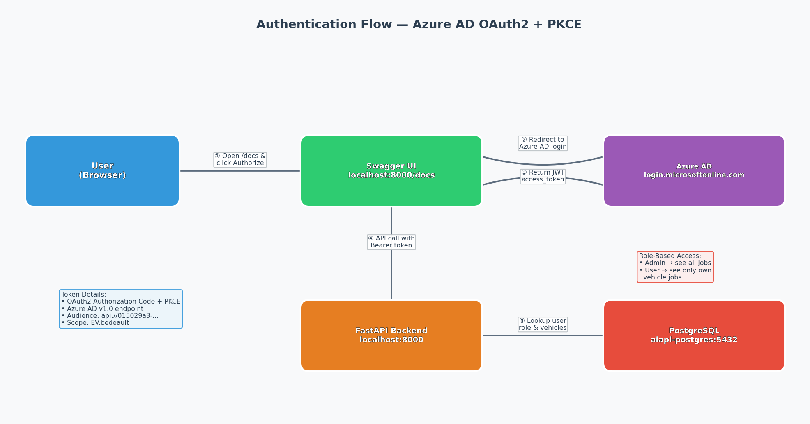
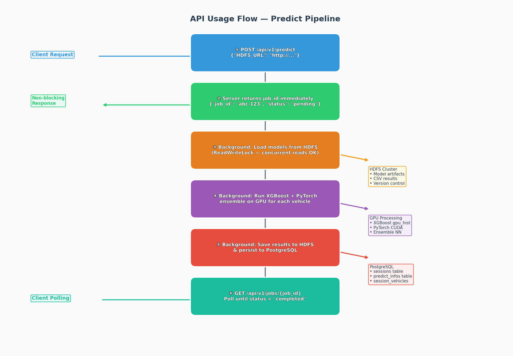
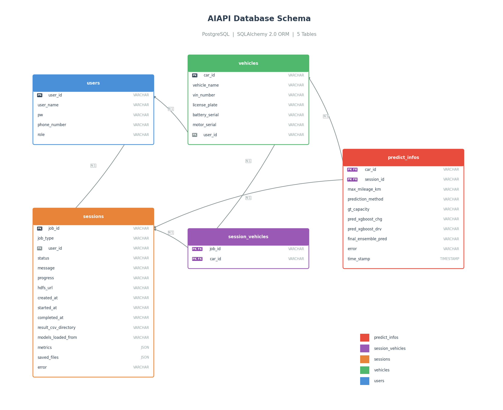

# AIAPI - EV Battery Health Prediction API

FastAPI backend for EV battery health prediction using GPU-accelerated ML models (XGBoost + PyTorch ensemble). Secured with Azure AD authentication.

## Prerequisites

- Docker with NVIDIA Container Toolkit (GPU support)
- NVIDIA GPU driver installed
- Access to corporate proxy (for Azure AD)

## Quick Start

### 1. Configure Environment

Copy the example env file and fill in your credentials:

```bash
cp .env.example .env
```

Edit `.env` — replace `<username>` and `<password>` with your proxy credentials:

```env
# ── HDFS Configuration ──
# URL of the HDFS NameNode WebHDFS endpoint (used for reading data & saving models/results)
HDFS_URL=http://hc1-c-0003u.hc.apac.bosch.com:9870
# HDFS username for file operations (read/write)
HDFS_USER=hdfs

# ── Authentication Configuration ──
# Set to false to disable Azure AD auth (all requests use template user)
AUTH_ENABLED=true
# User ID used when AUTH_ENABLED=false
TEMPLATE_USER_ID=templateUser

# ── Proxy Configuration ──
# Corporate proxy required for outbound HTTPS calls (Azure AD token validation)
# Format: http://<username>:<url-encoded-password>@<proxy-host>:<port>
HTTP_PROXY=http://<username>:<password>@rb-proxy-unix-apac.bosch.com:8080
HTTPS_PROXY=http://<username>:<password>@rb-proxy-unix-apac.bosch.com:8080
# Comma-separated list of hosts that should bypass the proxy
NO_PROXY=localhost,127.0.0.1,aiapi-postgres

# ── Job Manager Configuration ──
# Maximum number of concurrent background ML pipeline jobs (predict/train)
# Each job uses GPU resources, so keep this low to avoid GPU OOM
MAX_WORKERS=2

# ── PostgreSQL Configuration ──
# Credentials for the PostgreSQL database (used by both postgres container and SQLAlchemy)
POSTGRES_USER=aiapi
POSTGRES_PASSWORD=aiapi_secret
# Database name (auto-created by postgres container on first start)
POSTGRES_DB=aiapi_db
```

| Variable | Description | Default |
|----------|-------------|---------|
| `HDFS_URL` | HDFS NameNode URL | — |
| `HDFS_USER` | HDFS user | `hdfs` |
| `AUTH_ENABLED` | Enable Azure AD authentication | `true` |
| `TEMPLATE_USER_ID` | User ID when auth is disabled | `templateUser` |
| `HTTP_PROXY` / `HTTPS_PROXY` | Corporate proxy for Azure AD | — |
| `NO_PROXY` | Hosts to bypass proxy | — |
| `MAX_WORKERS` | Max concurrent background ML jobs | `2` |
| `POSTGRES_USER` | PostgreSQL username | `aiapi` |
| `POSTGRES_PASSWORD` | PostgreSQL password | — |
| `POSTGRES_DB` | PostgreSQL database name | `aiapi_db` |
| `DATABASE_URL` | SQLAlchemy connection string | auto from above |

### 2. Build the Docker Image

```bash
docker build --network host \
  --build-arg http_proxy=$HTTP_PROXY \
  --build-arg https_proxy=$HTTPS_PROXY \
  -t aiapi-backend .
```

### 3. Start Services

```bash
docker compose up -d
```

This starts:
- **aiapi-backend** (port 8000) — FastAPI app with GPU support
- **aiapi-postgres** (port 5432) — PostgreSQL database

### 4. Verify

```bash
curl http://localhost:8000/health
# {"status":"ok"}
```

## Authentication

All `/api/v1/*` endpoints are protected by **Azure AD OAuth2 + PKCE**. The `/health` endpoint is public.



### How to Authenticate

1. Open the Swagger UI at **http://localhost:8000/docs**
2. Click the **Authorize** button (lock icon, top-right)
3. In the dialog, check the scope `EV.bedeault` and click **Authorize**
4. You will be redirected to **Azure AD login** — sign in with your Bosch account
5. After successful login, you are redirected back to Swagger with a valid token
6. All subsequent API calls from Swagger will include the `Authorization: Bearer <token>` header automatically

### Using `curl` or Other Clients

If you prefer command-line or programmatic access, first obtain a token, then pass it as a header:

```bash
# Replace <YOUR_TOKEN> with the JWT access_token from Azure AD
curl -X POST http://localhost:8000/api/v1/predict \
  -H "Authorization: Bearer <YOUR_TOKEN>" \
  -H "Content-Type: application/json" \
  -d '{"HDFS_URL": "http://hc1-c-0003u.hc.apac.bosch.com:9870"}'
```

### Role-Based Access

| Role | Permissions |
|------|-------------|
| **Admin** | View all jobs from all users |
| **User** | View only jobs related to their registered vehicles |

User roles are stored in the `users` table. The user is identified from the `unique_name` (UPN) claim in the Azure AD JWT token.

## API Endpoints

| Method | Path | Auth | Description |
|--------|------|------|-------------|
| GET | `/health` | No | Health check |
| POST | `/api/v1/predict` | Yes | Run inference pipeline (non-blocking) |
| POST | `/api/v1/train` | Yes | Train model pipeline (non-blocking) |
| GET | `/api/v1/jobs` | Yes | List jobs (filtered by role) |
| GET | `/api/v1/jobs/{job_id}` | Yes | Get job status & result |
| GET | `/api/v1/vehicles` | Yes | List all vehicles for the authenticated user |
| POST | `/api/v1/vehicles` | Yes | Create a new vehicle |
| GET | `/api/v1/vehicles/{car_id}` | Yes | Get a specific vehicle's info |
| GET | `/api/v1/vehicles/{car_id}/predictions` | Yes | Get predictions for a vehicle (sorted by timestamp) |

## How to Use — Predict Pipeline

The predict pipeline is **non-blocking**: the API returns a `job_id` immediately, and the ML pipeline runs in the background on GPU.



### Step-by-Step

**1. Submit a predict request**

```bash
POST /api/v1/predict
{
  "HDFS_URL": "http://hc1-c-0003u.hc.apac.bosch.com:9870"
}
```

Response (immediate):
```json
{
  "job_id": "8d9cab94-1292-42c8-8035-a7188d27b97c",
  "job_type": "predict",
  "status": "pending",
  "message": "Job queued"
}
```

**2. Poll for completion**

```bash
GET /api/v1/jobs/8d9cab94-1292-42c8-8035-a7188d27b97c
```

While running:
```json
{
  "status": "running",
  "progress": "Step 2/4: Running XGBoost predictions..."
}
```

When complete:
```json
{
  "status": "completed",
  "message": "Pipeline completed successfully",
  "result": {
    "result_csv_directory": "http://...hdfs.../output_data",
    "models_loaded_from": "http://...hdfs.../models/.../v_20260513_...",
    "cars_predicted": ["EV_015", "EV_016"],
    "metrics": {
      "rmse_charging": 96.11,
      "rmse_driving": 89.54,
      "rmse_ensemble": 92.83
    },
    "saved_files": ["http://...hdfs.../output_data/inference_ensemble_result_....csv"]
  }
}
```

**3. List all jobs**

```bash
GET /api/v1/jobs
```

Returns all jobs sorted newest-first. Admin sees all; regular users see only their vehicles' jobs.

## How to Use — Vehicle & Prediction Endpoints

These endpoints let users query their registered vehicles and prediction history.

> **Note**: If a user authenticates for the first time and does not exist in the database, they are automatically created with a `User` role.

### Create a Vehicle

```bash
POST /api/v1/vehicles
```

Request body:
```json
{
  "car_id": "EV_001",
  "vehicle_name": "VinFast VF8",
  "vin_number": "VIN2026VF8X00001",
  "license_plate": "51A-12345",
  "battery_serial": "BAT-VF8-001",
  "motor_serial": "MOT-VF8-001"
}
```

Response (`201 Created`):
```json
{
  "car_id": "EV_001",
  "vehicle_name": "VinFast VF8",
  "vin_number": "VIN2026VF8X00001",
  "license_plate": "51A-12345",
  "battery_serial": "BAT-VF8-001",
  "motor_serial": "MOT-VF8-001",
  "user_id": "vkn1hc"
}
```

Returns `409 Conflict` if a vehicle with the same `car_id` already exists.

### List All Vehicles

```bash
GET /api/v1/vehicles
```

Response:
```json
{
  "user_id": "vkn1hc",
  "total": 2,
  "vehicles": [
    {
      "car_id": "EV_015",
      "vehicle_name": "VinFast VF8",
      "vin_number": "VIN123456",
      "license_plate": "51A-12345",
      "battery_serial": "BAT-001",
      "motor_serial": "MOT-001"
    }
  ]
}
```

### Get a Specific Vehicle

```bash
GET /api/v1/vehicles/EV_015
```

Response:
```json
{
  "car_id": "EV_015",
  "vehicle_name": "VinFast VF8",
  "vin_number": "VIN123456",
  "license_plate": "51A-12345",
  "battery_serial": "BAT-001",
  "motor_serial": "MOT-001",
  "user_id": "vkn1hc"
}
```

### Get Predictions for a Vehicle

Returns all prediction results for a car, sorted by `time_stamp` (newest first).

```bash
GET /api/v1/vehicles/EV_015/predictions
```

Response:
```json
{
  "car_id": "EV_015",
  "vehicle_name": "VinFast VF8",
  "total": 2,
  "predictions": [
    {
      "session_id": "8d9cab94-1292-42c8-8035-a7188d27b97c",
      "max_mileage_km": "150000",
      "prediction_method": "ensemble",
      "gt_capacity": "95.2",
      "pred_xgboost_chg": "93.8",
      "pred_xgboost_drv": "94.1",
      "final_ensemble_pred": "93.95",
      "error": null,
      "time_stamp": "2026-05-15T10:30:00"
    }
  ]
}
```

> **Note**: All vehicle endpoints are scoped to the authenticated user — you can only access vehicles registered under your account.

## Architecture

- **GPU**: NVIDIA CUDA 12.6 runtime, PyTorch cu121, XGBoost with GPU hist
- **Auth**: Azure AD v1.0 tokens via `fastapi-azure-auth`
- **Concurrency**: ThreadPoolExecutor with ReadWriteLock for HDFS model access
- **Model Versioning**: Timestamped model snapshots on HDFS with `latest.json` pointer
- **Database**: PostgreSQL 16 with SQLAlchemy 2.0 ORM
- **Role-based Access**: Admin sees all jobs; regular users see only their vehicles' jobs

## Database Schema

All tables are auto-created on startup via SQLAlchemy `Base.metadata.create_all()`.



| Table | Description |
|-------|-------------|
| `users` | User accounts with role (`Admin` / `User`) |
| `vehicles` | Registered EVs, each owned by a user |
| `sessions` | Persisted predict/train job results (status, metrics, HDFS paths) |
| `session_vehicles` | Many-to-many link between sessions and the vehicles they predicted |
| `predict_infos` | Per-vehicle prediction details (capacity, XGBoost predictions, error) |

### Relationships

- **users → vehicles**: One user owns many vehicles
- **users → sessions**: One user triggers many sessions
- **sessions ↔ vehicles**: Many-to-many via `session_vehicles`
- **vehicles → predict_infos**: One vehicle has one prediction per session
- **sessions → predict_infos**: One session produces many per-vehicle predictions

### Regenerate Diagrams

```bash
python docs/generate_db_diagram.py       # Database schema
python docs/generate_flow_diagrams.py    # Auth flow + API usage flow
```

## Stopping

```bash
docker compose down
```

To also remove the PostgreSQL data volume:

```bash
docker compose down -v
```
