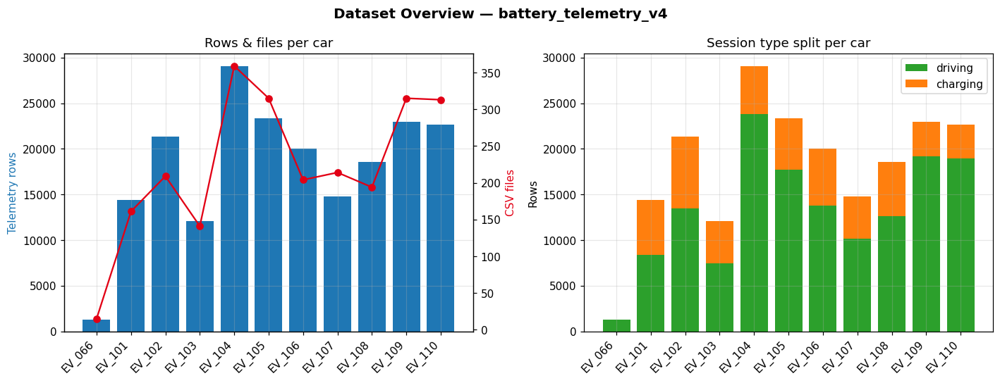
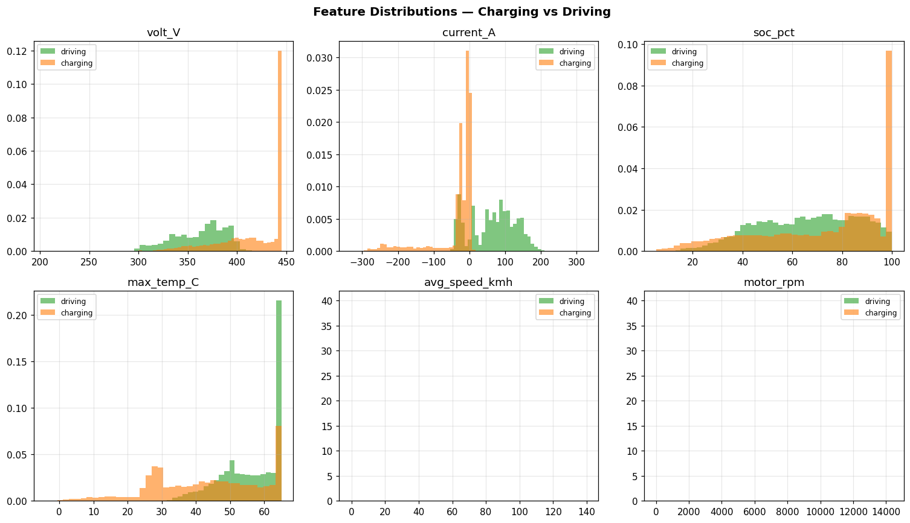
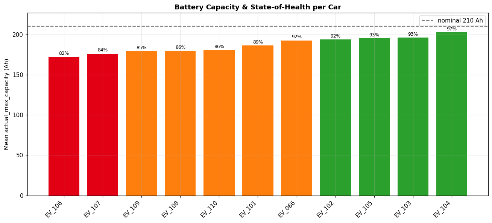
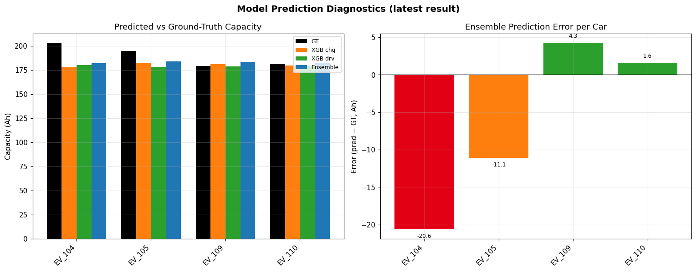

# fg-data-profiling — EDA Setup & Report Guide

> **Created:** 2026-06-20  
> **Author:** Battery Health ML team  
> **Tool:** [`fg-data-profiling`](https://github.com/Data-Centric-AI-Community/fg-data-profiling) (the renamed successor of `ydata-profiling`)  
> **Purpose:** One-line Exploratory Data Analysis (EDA) on the exported local dataset while HDFS is unavailable.

This document explains **what was set up, how to run it, and how to read every report**. It is the single reference for the local EDA workflow.

---

## Table of Contents
P
1. [Why this exists](#1-why-this-exists)
2. [Dataset under analysis](#2-dataset-under-analysis)
3. [Setup — install fg-data-profiling](#3-setup--install-fg-data-profiling)
4. [How to run](#4-how-to-run)
5. [Reports produced & how to read them](#5-reports-produced--how-to-read-them)
6. [Preview charts (generated locally)](#6-preview-charts-generated-locally)
7. [Reading an fg-data-profiling HTML report](#7-reading-an-fg-data-profiling-html-report)
8. [Known data-quality alerts to expect](#8-known-data-quality-alerts-to-expect)
9. [Reference / links](#9-reference--links)

---

## 1  Why this exists

The production pipeline normally reads telemetry from **HDFS**
(`/raw_data/battery_telemetry_v4`). HDFS is currently **not accessible**, so the
data was exported locally:

| Data | Local path |
|---|---|
| Training telemetry input | `App/dataset/battery_telemetry_v4/{car_id}/*.csv` |
| Prediction output | `App/dataset/output/inference_*_result_*.csv` |

`fg-data-profiling` lets us generate a **complete EDA report in one line of code**
(like an extended `df.describe()`) so we can validate data quality before
retraining — without any HDFS connection.

---

## 2  Dataset under analysis

Loaded from `App/dataset/battery_telemetry_v4/` — **11 cars, 2 440 CSV files,
200 609 rows, 27 columns**.

| Car | Rows | Files | Segments | Mean Capacity (Ah) | SoH % |
|---|---:|---:|---:|---:|---:|
| EV_066 | 1 322 | 15 | 11 | 192.6 | 91.7 |
| EV_101 | 14 379 | 161 | 113 | 186.4 | 88.8 |
| EV_102 | 21 376 | 209 | 168 | 193.7 | 92.2 |
| EV_103 | 12 067 | 141 | 95 | 196.1 | 93.4 |
| **EV_104** | 29 016 | 359 | 219 | 202.7 | 96.5 |
| **EV_105** | 23 368 | 315 | 176 | 195.3 | 93.0 |
| EV_106 | 20 053 | 204 | 157 | 172.4 | 82.1 |
| EV_107 | 14 799 | 214 | 102 | 176.2 | 83.9 |
| EV_108 | 18 576 | 194 | 146 | 179.8 | 85.6 |
| **EV_109** | 22 995 | 315 | 171 | 179.4 | 85.4 |
| **EV_110** | 22 658 | 313 | 168 | 180.8 | 86.1 |

> Bold = the four **focus cars** used in evaluation.

**Session split:** 53 727 charging rows (`charger_connected=1`) vs 146 882 driving
rows (`charger_connected=0`).  
**Nulls:** 20 542, all in the `vehicle_name` column.  
**Duplicate rows:** 0.

---

## 3  Setup — install fg-data-profiling

`fg-data-profiling` replaces `ydata-profiling`. The import name is
`data_profiling`.

### 3.1  Use the project environment

The project already ships a virtual environment at the repo root (`.venv`) with
`pandas`, `numpy` and `matplotlib` installed. Activate it:

```bash
cd machineLearningEV          # repo root
source .venv/bin/activate     # Windows: .venv\Scripts\activate
python -m pip install --upgrade pip
```

### 3.2  Install the package

```bash
pip install fg-data-profiling
```

> If you previously had the old package, migrate:
> ```bash
> pip uninstall ydata-profiling
> pip install fg-data-profiling
> ```
> and change imports `from ydata_profiling import ProfileReport`
> → `from data_profiling import ProfileReport`.

### 3.3  Extras (optional)

```bash
pip install "fg-data-profiling[notebook]"   # inline Jupyter widgets
```

---

## 4  How to run

There are **two entry points**, both already created in this repo.

### 4.1  Preview charts (matplotlib, no profiling needed)

Generates the 4 summary PNGs embedded in this document.

```bash
source .venv/bin/activate          # from repo root
cd App
python src/AIAPI/docs/generate_eda_preview_images.py
```

Output → `src/AIAPI/docs/images/eda_0*.png`

### 4.2  Full EDA notebook (fg-data-profiling)

```bash
source .venv/bin/activate          # from repo root
cd App
pip install fg-data-profiling jupyter
jupyter notebook ../notebooks/eda_battery_telemetry.ipynb
```

Run all cells. Reports are written to **`App/dataset/eda_reports/`**.

### 4.3  Minimal one-liner (any DataFrame)

```python
import pandas as pd
from data_profiling import ProfileReport

df = pd.read_csv("dataset/battery_telemetry_v4/EV_104/EV_104_20260511_160011.csv")
ProfileReport(df, title="EV_104 sample").to_file("eda_sample.html")
```

### 4.4  Command line (single CSV)

```bash
data_profiling --title "EV_104 sample" \
  dataset/battery_telemetry_v4/EV_104/EV_104_20260511_160011.csv \
  eda_sample.html
```

---

## 5  Reports produced & how to read them

The notebook ([notebooks/eda_battery_telemetry.ipynb](../../../../notebooks/eda_battery_telemetry.ipynb))
generates five HTML reports in `App/dataset/eda_reports/`:

| # | Report file | Scope | What to look for |
|---|---|---|---|
| 1 | `eda_full_report.html` | All 11 cars combined | Global distributions, correlations, missing-value matrix, automatic data-quality **Alerts** |
| 2 | `eda_compare_chg_drv.html` | Charging vs Driving | Feature differences between the two session types — confirms why XGBoost trains **two** models |
| 3 | `eda_ts_EV_104.html` | Single car, time-series mode | ACF / PACF, seasonality and stationarity per feature (`volt_V`, `current_A`, `soc_pct`) |
| 4 | `eda_compare_focus_cars.html` | EV_104 / 105 / 109 / 110 | Spot the outlier car across features |
| 5 | `eda_predictions_report.html` | All inference results | Prediction distribution, per-car error bias, XGB vs Ensemble correlation |

Each report is a **standalone HTML file** — open it directly in any browser.

---

## 6  Preview charts (generated locally)

These PNGs are produced by
[generate_eda_preview_images.py](generate_eda_preview_images.py) and give a quick
visual summary before opening the full interactive reports.

### 6.1  Dataset overview

Rows & CSV files per car (left) and the charging/driving session split (right).



### 6.2  Feature distributions — charging vs driving

Density histograms for the six main ML features, split by session type. Note how
`current_A`, `soc_pct` and `motor_rpm` behave very differently between charging
and driving — the reason the pipeline keeps separate feature sets.



### 6.3  Capacity & State-of-Health per car

Mean `actual_max_capacity_Ah` per car against the 210 Ah nominal. Green ≥ 92 %,
orange 85–92 %, red < 85 % SoH.



### 6.4  Prediction diagnostics

Latest `inference_ensemble_result` — predicted vs ground-truth capacity (left)
and per-car error (right). EV_104 currently shows the largest under-prediction.



---

## 7  Reading an fg-data-profiling HTML report

Every report has the same structure:

| Section | Contents |
|---|---|
| **Overview** | Number of records & variables, missing %, duplicate %, memory size |
| **Alerts** | Auto-detected issues: high correlation, skewness, zeros, constants, high cardinality, missing values |
| **Variables** | Per-column: type, distinct count, missing, mean/median/quantiles, histogram |
| **Interactions** | Pairwise scatter plots between numeric variables |
| **Correlations** | Pearson / Spearman / auto heatmaps |
| **Missing values** | Bar + matrix view of where data is absent |
| **Sample** | First & last rows of the data |

**Workflow:** start at **Alerts** → these flag the data-quality problems that
matter most. Then drill into the specific **Variable** the alert points to.

---

## 8  Known data-quality alerts to expect

From the local export, the profiler will surface these (already verified):

| Alert | Column(s) | Explanation / action |
|---|---|---|
| Missing values | `vehicle_name` | 20 542 nulls — cosmetic only, not used as a feature |
| Imbalance | `charger_connected` | ~73 % driving vs 27 % charging — expected; respect the split when sampling |
| Skewness / zeros | `current_A`, `regenerative_braking_Ah` | Regen produces many zeros + negatives — expected sign convention |
| Low data | `EV_066` | Only 15 files / 1 322 rows — treat its predictions with low confidence |
| High correlation | `volt_V` ↔ `min/max_single_volt_V` | Pack voltage tracks cell voltage — drop redundant columns before training |

---

## 9  Reference / links

- **fg-data-profiling repo:** https://github.com/Data-Centric-AI-Community/fg-data-profiling
- **Documentation:** https://docs.profiling.ydata.ai/latest/
- **Time-series EDA guide:** https://docs.profiling.ydata.ai/latest/features/time_series_datasets/
- **Comparing datasets:** https://docs.profiling.ydata.ai/latest/features/comparing_datasets/
- **This repo:**
  - Notebook → [notebooks/eda_battery_telemetry.ipynb](../../../../notebooks/eda_battery_telemetry.ipynb)
  - Image generator → [generate_eda_preview_images.py](generate_eda_preview_images.py)
  - Generated reports → `App/dataset/eda_reports/*.html`
