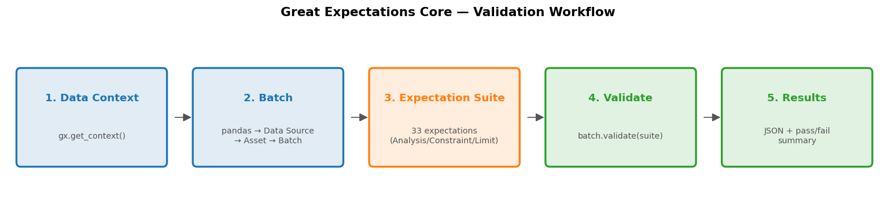
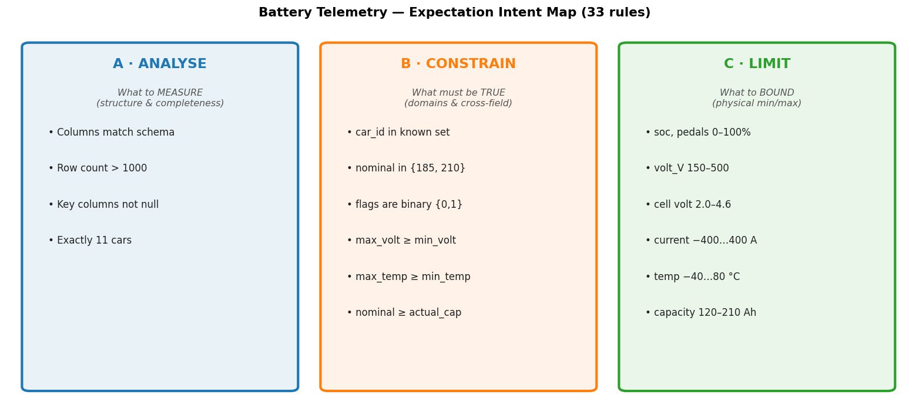
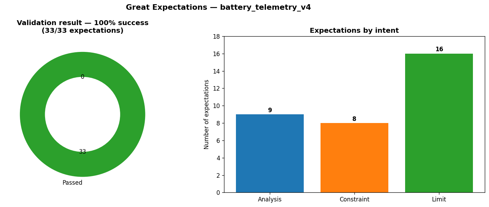

# Great Expectations — Battery Telemetry Data-Quality Guide

> **Created:** 2026-06-21  
> **Script:** [`gx_battery_telemetry.py`](../data_quality/gx_battery_telemetry.py)  
> **Tool:** [Great Expectations Core (GX 1.x)](https://docs.greatexpectations.io/docs/core/introduction/try_gx/)  
> **Dataset:** `App/dataset/battery_telemetry_v4/` — 11 cars, 2 440 CSVs, **200 609 rows**, 26 columns

This document explains **what the validation does, how to set it up, the steps it
runs, and the conditions (expectations) it checks** — so anyone can run the
data-quality gate before retraining.

---

## Table of Contents
1. [Why data validation](#1-why-data-validation)
2. [Setup](#2-setup)
3. [How to run](#3-how-to-run)
4. [The GX workflow (5 steps)](#4-the-gx-workflow-5-steps)
5. [The conditions we check](#5-the-conditions-we-check)
   - [A · Analysis](#a--analysis--what-to-measure)
   - [B · Constraint](#b--constraint--what-must-be-true)
   - [C · Limit](#c--limit--what-to-bound)
6. [Validation result](#6-validation-result)
7. [When to use this](#7-when-to-use-this)
8. [Reference](#8-reference)

---

## 1  Why data validation

The battery-health pipeline trains on telemetry exported from HDFS. If a bad CSV
sneaks in (a sensor glitch, a wrong car ID, a capacity above nominal), the model
silently learns garbage. **Great Expectations** lets us assert — in code — what
"good data" looks like, and fail fast when reality disagrees.

Three questions drive every rule:

| Question | Intent | Example |
|---|---|---|
| What should we **measure**? | Analysis | Are all columns present? Any nulls? |
| What must always be **true**? | Constraint | `car_id` is one of 11 known cars |
| What are the **physical limits**? | Limit | `soc_pct` between 0–100 |

---

## 2  Setup

GX Core is a Python library. It is installed into the project `.venv`.

```bash
cd machineLearningEV          # repo root
source .venv/bin/activate     # Windows: .venv\Scripts\activate
pip install great_expectations
python -c "import great_expectations as gx; print(gx.__version__)"   # 1.18.1
```

> Requires Python 3.10–3.13 and `pandas` (already in `.venv`).

---

## 3  How to run

```bash
source .venv/bin/activate
python App/src/AIAPI/data_quality/gx_battery_telemetry.py
```

**Outputs:**
- Console: pass/fail summary
- File: `App/dataset/gx_results/validation_result.json` (full machine-readable results)

To regenerate the diagrams in this doc:
```bash
python App/src/AIAPI/docs/generate_gx_images.py
```

---

## 4  The GX workflow (5 steps)

The script follows the standard GX Core pattern:



| Step | Code | What happens |
|---|---|---|
| 1. Data Context | `gx.get_context()` | Entry point for all GX components |
| 2. Batch | `add_pandas(...) → add_dataframe_asset(...) → get_batch(...)` | Wraps the combined DataFrame as a validatable batch |
| 3. Expectation Suite | `gx.ExpectationSuite(expectations=[...])` | 33 rules grouped into 3 intents |
| 4. Validate | `batch.validate(suite)` | Runs every expectation against 200 609 rows |
| 5. Results | `results.to_json_dict()` | Pass/fail summary + JSON file |

> Note: in GX 1.x the **Data Context must be created before** building the suite,
> otherwise `add()` raises `DataContextRequiredError`.

---

## 5  The conditions we check

33 expectations, grouped by intent:



### A · Analysis — *what to measure*

Structural integrity: is the table well-formed and complete?

| Expectation | Column(s) | Severity | Why |
|---|---|---|---|
| `ExpectTableColumnsToMatchSet` | all 23 required | critical | schema didn't drift |
| `ExpectTableRowCountToBeBetween(min=1000)` | — | warning | not empty/truncated |
| `ExpectColumnValuesToNotBeNull` | `car_id`, `id_segment`, `actual_max_capacity_Ah`, `nominal_capacity_Ah`, `charger_connected`, `timestamp_s` | critical | identity & label completeness |
| `ExpectColumnUniqueValueCountToBeBetween(11, 11)` | `car_id` | warning | exactly 11 cars |

> `vehicle_name` is **deliberately excluded** from the not-null check — it has
> 20 542 nulls but is cosmetic, not a model feature.

### B · Constraint — *what must be true*

Domain membership + cross-field physics (mostly `critical`).

| Expectation | Rule |
|---|---|
| `ExpectColumnValuesToBeInSet` | `car_id` ∈ 11 known IDs |
| `ExpectColumnValuesToBeInSet` | `nominal_capacity_Ah` ∈ {185, 210} |
| `ExpectColumnValuesToBeInSet` | `gear_position` ∈ {D, P} |
| `ExpectColumnValuesToBeInSet` | `charger_connected`, `hvac_active` ∈ {0, 1} |
| `ExpectColumnPairValuesAToBeGreaterThanB` | `max_single_volt_V ≥ min_single_volt_V` |
| `ExpectColumnPairValuesAToBeGreaterThanB` | `max_temp_C ≥ min_temp_C` |
| `ExpectColumnPairValuesAToBeGreaterThanB` | `nominal_capacity_Ah ≥ actual_max_capacity_Ah` |

> The last rule is the most important label sanity check: **a degraded battery's
> capacity can never exceed its nominal capacity.**

### C · Limit — *what to bound*

Physical min/max plausibility per sensor (`ExpectColumnValuesToBeBetween`, `warning`).

| Column | Bound | Reason |
|---|---|---|
| `soc_pct`, `accelerator_pedal_pct`, `brake_pedal_pct` | 0 – 100 | percentages |
| `avg_speed_kmh` | 0 – 200 | speed |
| `motor_rpm` | 0 – 20 000 | motor ceiling |
| `volt_V` | 150 – 500 | pack voltage |
| `min/max_single_volt_V` | 2.0 – 4.6 | Li-ion cell voltage |
| `min/max_temp_C` | −40 – 80 | sensor range |
| `current_A` | −400 – 400 | + discharge / − charge |
| `regenerative_braking_Ah` | 0 – 5 | non-negative regen |
| `payload_kg` | 0 – 500 | load |
| `mileage_km` | 0 – 1 000 000 | odometer |
| `actual_max_capacity_Ah` | 120 – 210 | SoH ≈ 57–100% |
| `timestamp_s` | ≥ 0 | non-negative time |

> `current_A` is bounded **symmetrically** (not ≥ 0) because negative current
> means charging.

---

## 6  Validation result

Latest run — **all 33 expectations pass** on the full 200 609-row dataset:



```
OVERALL SUCCESS : True
Evaluated       : 33
Successful      : 33
Failed          : 0
Success %       : 100.0
```

### Severity policy

| Severity | Meaning | Used for |
|---|---|---|
| `critical` | Pipeline-breaking — abort retraining | schema, domains, physical impossibilities |
| `warning` | Suspicious — log & review, don't block | statistical bounds, cardinality |

---

## 7  When to use this

| Situation | Action |
|---|---|
| **Before every retraining** | Run as a gate — abort if any `critical` fails |
| **New data export from HDFS** | Validate the fresh batch before merging |
| **New car added** | Update `KNOWN_CARS` and the `11→11` cardinality rule |
| **CI / scheduled job** | Wire the script's exit status into the pipeline |
| **Investigating model drift** | Compare validation JSON across data versions |

### Known data note (surfaced by EDA, not yet a hard rule)
- `label` column is constant (all `0`) — confirm with the team whether it should
  carry real values before adding an expectation.

---

## 8  Reference

- **Try GX Core:** https://docs.greatexpectations.io/docs/core/introduction/try_gx/
- **Expectations Gallery:** https://greatexpectations.io/expectations
- **This repo:**
  - Validation script → [data_quality/gx_battery_telemetry.py](../data_quality/gx_battery_telemetry.py)
  - Image generator → [generate_gx_images.py](generate_gx_images.py)
  - Results JSON → `App/dataset/gx_results/validation_result.json`
  - Companion EDA guide → [fg_data_profiling_guide.md](fg_data_profiling_guide.md)
