# Battery Health Prediction — Math Analysis

> **Source files:** `api/train_pipeline.py` · `core/split_and_extract.py` · `core/nn.py` · `core/snippetbuffer.py`  
> **Target label:** `actual_max_capacity_Ah` — battery State-of-Health proxy (Amp-hours)

---

## Pipeline Overview

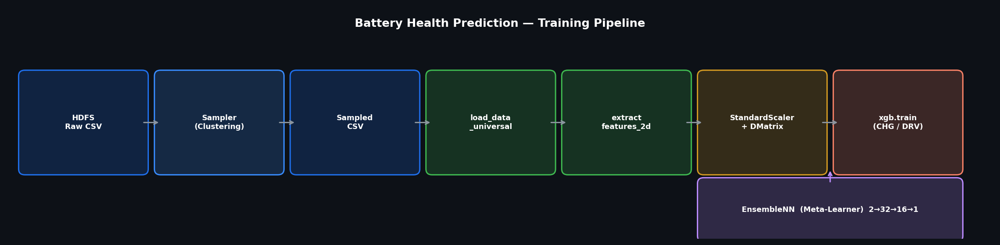

| Stage | Component | Description |
|---|---|---|
| 1 | `battery_hdfs_sampler.py` | Reads raw HDFS telemetry, clusters & samples → writes to `/raw_sample_data/sampled_training/` |
| 2 | `train_pipeline.py` | Reads sampled CSVs → trains XGBoost (CHG + DRV) + EnsembleNN → saves versioned models |
| 3 | `train.py` | Loads models → runs inference → saves results CSV |

---

## Step 1 — Window Extraction (`GlobalSnippetBuffer`)

Raw telemetry is a continuous stream. The buffer slices it into **fixed-size windows** of `WINDOW_SIZE = 128` rows.

A window is only emitted when 128 consecutive rows with `step_idx` 0 → 127 are accumulated:

$$W_i \in \mathbb{R}^{128 \times 7}$$

**Features used (`FEATURE_COLS_DRV = FEATURE_COLS_CHG`):**

| # | Column | Unit |
|---|---|---|
| 1 | `volt_V` | V |
| 2 | `current_A` | A |
| 3 | `soc_pct` | % |
| 4 | `max_single_volt_V` | V |
| 5 | `min_single_volt_V` | V |
| 6 | `max_temp_C` | °C |
| 7 | `min_temp_C` | °C |

---

## Step 2 — Feature Extraction: `extract_features_2d`

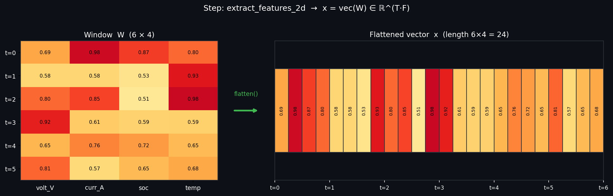

Each window $W_i \in \mathbb{R}^{T \times F}$ is **flattened row-by-row** into a 1D vector:

$$\mathbf{x}_i = \text{vec}(W_i) \in \mathbb{R}^{T \cdot F}$$

For this project: $T = 128$, $F = 7$ → **896 features per sample**.

```python
X[i] = x.flatten()           # shape (128,7) → (896,)
y[i] = meta["actual_max_capacity_Ah"]
```

Output matrix $X \in \mathbb{R}^{N \times 896}$, label vector $\mathbf{y} \in \mathbb{R}^{N}$.

---

## Step 3 — Normalization: `StandardScaler`

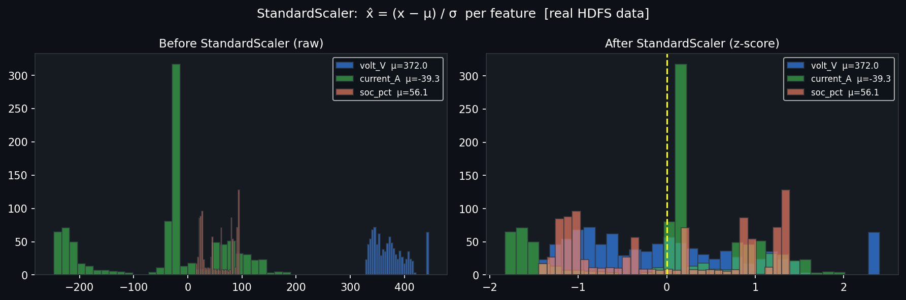

Applied **per feature column** across all training samples:

$$\hat{x}_{ij} = \frac{x_{ij} - \mu_j}{\sigma_j}$$

$$\mu_j = \frac{1}{N}\sum_{i=1}^{N} x_{ij}, \qquad \sigma_j = \sqrt{\frac{1}{N}\sum_{i=1}^{N}(x_{ij} - \mu_j)^2}$$

- `scaler_chg` fitted on charging train set → applied to charging val/inference
- `scaler_drv` fitted on driving train set → applied to driving val/inference

---

## Step 4 — Train/Val Split: `split_train_test_by_car`

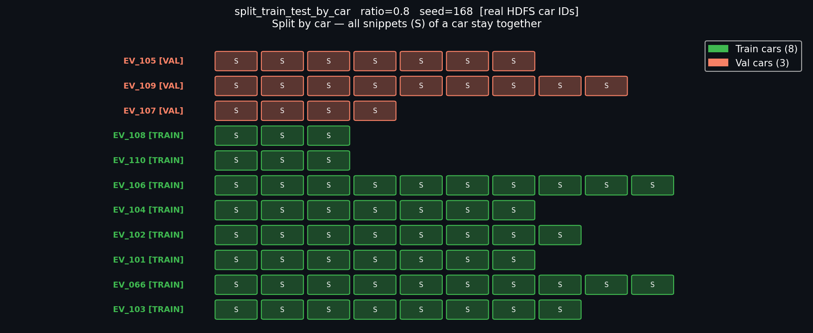

Split is done at **car level** (not snippet level) to prevent data leakage:

$$|\mathcal{C}_{train}| = \lfloor 0.8 \cdot |\mathcal{C}| \rfloor, \quad |\mathcal{C}_{val}| = |\mathcal{C}| - |\mathcal{C}_{train}|, \quad \text{seed}=168$$

All snippets of a car go entirely into either train **or** val — never both.

---

## Step 5 — XGBoost Training (Charging & Driving)

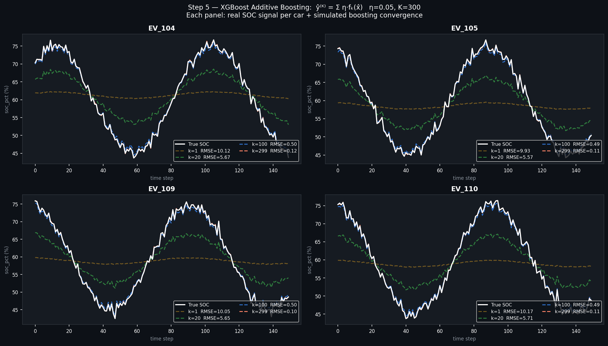

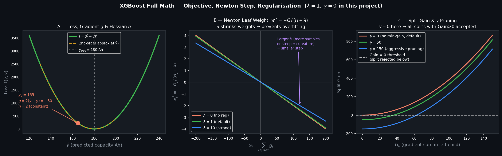

Two **independent** XGBoost regressors are trained — one for charging sessions, one for driving sessions.

### Additive Model

At round $k$ the model adds one new tree $f_k$ to correct the residual error from all previous trees:

$$\hat{y}_i^{(K)} = \sum_{k=1}^{K} \eta \cdot f_k(\hat{\mathbf{x}}_i), \qquad \eta = 0.05,\ K = 300$$

### Full Objective Function

$$\mathcal{L}^{(k)} = \sum_{i=1}^{n} \underbrace{\ell\!\left(y_i,\ \hat{y}_i^{(k-1)} + f_k(\hat{\mathbf{x}}_i)\right)}_{\text{training loss}} + \underbrace{\gamma T_k + \frac{\lambda}{2}\sum_{j=1}^{T_k} w_{kj}^2}_{\Omega(f_k)\ \text{(complexity penalty)}}$$

| Symbol | Meaning | Value in this project |
|---|---|---|
| $\ell$ | Per-sample loss (`reg:squarederror`): $\ell = (\hat{y}_i - y_i)^2$ | squared error |
| $T_k$ | Number of leaves in tree $k$ | controlled by `max_depth=8` |
| $w_{kj}$ | Output weight of leaf $j$ in tree $k$ | optimised analytically |
| $\gamma$ | Minimum gain required to make a split (leaf regularisation) | **0** (default — not set in code, so all splits with Gain > 0 are accepted) |
| $\lambda$ | L2 penalty on leaf weights (shrinks $w^*$ toward 0) | **1** (default `reg_lambda`) |

**When $\gamma = 0$:** the term $\gamma T_k$ vanishes, so no split is penalised for adding leaves — XGBoost grows trees up to `max_depth` as long as the squared-error gain is positive.

#### Loss function $\ell$ — available objectives and their derivatives

The **regularisation $\Omega$ is always identical**; only $\ell$ (and therefore $g_i$, $h_i$) changes per objective. XGBoost always applies the same Newton formula $w^* = -G/(H+\lambda)$ regardless of which objective is chosen.

| Objective | Loss $\ell(\hat{y}, y)$ | $g_i = \partial\ell/\partial\hat{y}$ | $h_i = \partial^2\ell/\partial\hat{y}^2$ | Constant $h$? |
|---|---|---|---|---|
| **`reg:squarederror` ← this project** | $(\hat{y}-y)^2$ | $2(\hat{y}-y)$ | $2$ | ✓ always 2 |
| `reg:absoluteerror` | $\|\hat{y}-y\|$ | $\text{sign}(\hat{y}-y)$ | $0$ (undefined at 0) | ✓ effectively |
| `reg:pseudohubererror` | Huber (smooth MAE) | varies | varies with $\hat{y}-y$ | ✗ |
| `binary:logistic` | $-y\log p-(1-y)\log(1-p)$ | $p - y$ | $p(1-p)$ | ✗ depends on $\hat{p}$ |
| `multi:softmax` | cross-entropy | $p_k - \mathbf{1}[y=k]$ | $p_k(1-p_k)$ | ✗ |
| `reg:tweedie` | Tweedie deviance | varies | $e^{(2-\rho)\hat{y}}$ | ✗ |
| `count:poisson` | $e^{\hat{y}} - y\hat{y}$ | $e^{\hat{y}} - y$ | $e^{\hat{y}}$ | ✗ |
| `rank:ndcg` | listwise ranking | pairwise gradients | pairwise hessians | ✗ |

> **Why constant $h_i = 2$ matters for `reg:squarederror`:** the loss is a perfect parabola — identical curvature everywhere. The Newton step reduces to a simple weighted mean of gradients, making it computationally cheap. For `binary:logistic`, $h_i = p(1-p)$ is near 0 for very confident predictions, so the step adapts per sample — that is the real advantage of second-order optimisation.

### Why We Need Two Derivatives (Panel A)

XGBoost uses a **second-order Taylor approximation** of the loss around the current prediction $\hat{y}_i^{(k-1)}$:

$$\mathcal{L}^{(k)} \approx \sum_i \left[ g_i f_k(\hat{\mathbf{x}}_i) + \frac{1}{2} h_i f_k(\hat{\mathbf{x}}_i)^2 \right] + \Omega(f_k)$$

For `reg:squarederror`:

$$g_i = \frac{\partial \ell}{\partial \hat{y}_i} = 2(\hat{y}_i - y_i) \quad \leftarrow \text{direction to move}$$

$$h_i = \frac{\partial^2 \ell}{\partial \hat{y}_i^2} = 2 \quad \leftarrow \text{curvature (how fast the loss bends)}$$

The **first derivative $g_i$** tells the tree which direction to push the prediction.  
The **second derivative $h_i$** tells it *how large* the step should be — large curvature → small step (more careful). This is exactly the Newton–Raphson update, but solved analytically in closed form.

### Newton Step — Optimal Leaf Weight (Panel B)

Minimising the approximate loss over leaf weight $w_j$ gives the closed-form solution:

$$w_j^* = -\frac{G_j}{H_j + \lambda}$$

$$G_j = \sum_{i \in \text{leaf}_j} g_i \qquad H_j = \sum_{i \in \text{leaf}_j} h_i$$

- **$\lambda$ dampens $w^*$**: when $\lambda$ is large, even a large gradient sum $G_j$ produces a small leaf weight → less overfitting.
- **$H_j$ scales the step**: more samples in the leaf (larger $H_j$) → smaller, more reliable weight.

#### Proof — Derivation from Taylor 2nd-Order Approximation

**Step 1 — Additive objective at round $k$**

At boosting round $k$ we add a new tree $f_k$. The objective is:

$$\text{Obj}^{(k)} = \sum_{i=1}^{n} \ell\!\left(y_i,\; \hat{y}_i^{(k-1)} + f_k(x_i)\right) + \Omega(f_k)$$

where $\hat{y}_i^{(k-1)}$ is the fixed prediction from all previous trees.

**Step 2 — Taylor 2nd-order expansion**

Expand $\ell$ around $\hat{y}_i^{(k-1)}$ with $\delta = f_k(x_i)$:

$$\ell(y_i,\; \hat{y}_i^{(k-1)} + \delta) \approx \underbrace{\ell(y_i, \hat{y}_i^{(k-1)})}_{\text{constant — drop}} + g_i\,\delta + \frac{1}{2}\,h_i\,\delta^2$$

where $g_i = \dfrac{\partial \ell}{\partial \hat{y}_i^{(k-1)}}$ and $h_i = \dfrac{\partial^2 \ell}{\partial (\hat{y}_i^{(k-1)})^2}$.

Drop the constant term (doesn't affect the minimum):

$$\text{Obj}^{(k)} \approx \sum_{i=1}^{n} \left[ g_i f_k(x_i) + \frac{1}{2} h_i f_k(x_i)^2 \right] + \Omega(f_k)$$

**Step 3 — Expand the regularisation term**

For a tree with $T$ leaves and leaf weights $w_j$:

$$\Omega(f_k) = \gamma T + \frac{1}{2}\lambda \sum_{j=1}^{T} w_j^2$$

> **Why is $\frac{1}{2}\lambda\sum w_j^2$ still here — is it removed?**
>
> **No — it is NOT removed.** It stays and gets **merged** into the quadratic term in Step 4.
> Recall from Step 2 the Taylor expansion already has a $\frac{1}{2}h_i\,\delta^2$ term.
> When both are grouped by leaf:
>
> $$\underbrace{\frac{1}{2}\sum_{i \in I_j} h_i \, w_j^2}_{\text{from Taylor}} + \underbrace{\frac{1}{2}\lambda\, w_j^2}_{\text{from }\Omega} = \frac{1}{2}\underbrace{\left(\sum_{i \in I_j} h_i + \lambda\right)}_{H_j\,+\,\lambda} w_j^2$$
>
> The two $\frac{1}{2}w_j^2$ terms **combine** — $\lambda$ simply adds to $H_j$ inside the same coefficient.
> This is why $\lambda$ appears in the denominator of $w_j^* = -G_j/(H_j+\lambda)$: it came from $\Omega$.
>
> The $\frac{1}{2}$ factor in $\Omega$ is a deliberate **mathematical convenience** — it ensures the derivative of $\frac{1}{2}\lambda w_j^2$ is exactly $\lambda w_j$ (no factor of 2), keeping the final formula clean.

**Step 4 — Group samples by leaf**

All samples $i$ in leaf $j$ share the same weight $w_j = f_k(x_i)$. Rewrite the sum over $n$ samples as a sum over $T$ leaves:

$$\text{Obj}^{(k)} \approx \sum_{j=1}^{T} \left[ \underbrace{\left(\sum_{i \in I_j} g_i\right)}_{G_j} w_j + \frac{1}{2} \underbrace{\left(\sum_{i \in I_j} h_i + \lambda\right)}_{H_j + \lambda} w_j^2 \right] + \gamma T$$

Each leaf $j$ is now **independent** — a simple quadratic in $w_j$:

$$\text{Obj}_j = G_j\,w_j + \frac{1}{2}(H_j + \lambda)\,w_j^2$$

**Step 5 — Minimise (set derivative = 0)**

> **Why can we set the derivative = 0 to find the minimum?**
>
> From calculus: at the **minimum of any smooth function**, the slope (tangent line) is flat — i.e. the derivative equals zero.
>
> $$\text{slope} > 0 \Rightarrow \text{still going up (not minimum yet)}$$
> $$\text{slope} < 0 \Rightarrow \text{still going down (not minimum yet)}$$
> $$\text{slope} = 0 \Rightarrow \text{flat} \Rightarrow \text{candidate for minimum (or maximum)}$$
>
> Our objective per leaf is a **quadratic** in $w_j$:
>
> $$\text{Obj}_j = \underbrace{G_j}_{\text{linear coeff}}\,w_j + \frac{1}{2}\underbrace{(H_j+\lambda)}_{\text{must be} > 0}\,w_j^2$$
>
> Because the coefficient of $w_j^2$ is $(H_j + \lambda) > 0$ (Hessian $H_j \geq 0$, $\lambda > 0$), the parabola opens **upward** — so the point where slope = 0 is guaranteed to be a **minimum**, not a maximum.
>
> If the parabola opened **downward** (negative leading coefficient), slope = 0 would be a maximum — but that cannot happen here since $H_j + \lambda > 0$ always.

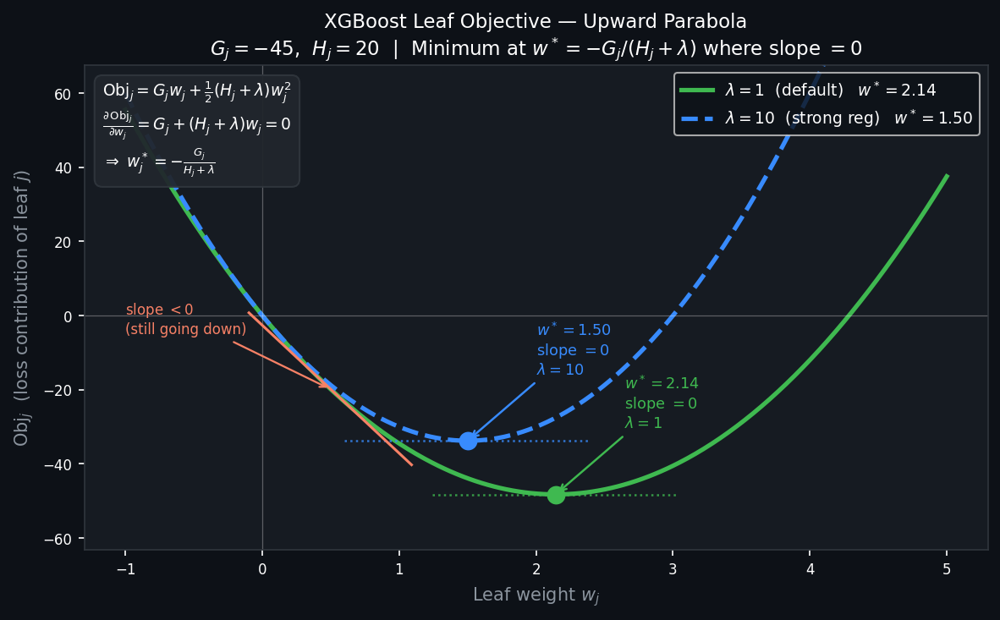

Take the derivative of $\text{Obj}_j$ with respect to $w_j$ and set it to zero:

$$\frac{\partial\;\text{Obj}_j}{\partial w_j} = G_j + (H_j + \lambda)\,w_j = 0$$

Solve for $w_j$:

$$(H_j + \lambda)\,w_j = -G_j$$

$$\boxed{w_j^* = -\frac{G_j}{H_j + \lambda}}$$

This is one Newton step on the 2nd-order approximation. The denominator $(H_j + \lambda)$ is the curvature — larger curvature means a smaller, safer step.

**Step 6 — Optimal objective value (substitute $w_j^*$ back)**

$$\text{Obj}_j^* = G_j \cdot\left(-\frac{G_j}{H_j+\lambda}\right) + \frac{1}{2}(H_j+\lambda)\cdot\frac{G_j^2}{(H_j+\lambda)^2} = -\frac{1}{2}\frac{G_j^2}{H_j+\lambda}$$

This score is what XGBoost uses to evaluate each leaf — and the **split gain** is the score improvement from splitting one leaf into two:

$$\text{Gain} = \frac{1}{2}\left[\frac{G_L^2}{H_L+\lambda} + \frac{G_R^2}{H_R+\lambda} - \frac{(G_L+G_R)^2}{H_L+H_R+\lambda}\right] - \gamma$$

### Split Gain & $\gamma$ Pruning (Panel C)

When deciding whether to split a leaf, XGBoost computes the gain:

$$\text{Gain} = \frac{1}{2}\left[\frac{G_L^2}{H_L+\lambda} + \frac{G_R^2}{H_R+\lambda} - \frac{(G_L+G_R)^2}{H_L+H_R+\lambda}\right] - \gamma$$

A split is only accepted if **Gain > 0**. With $\gamma = 0$ (this project) every split that reduces squared error is accepted. Increasing $\gamma$ prunes shallow, low-gain branches.

### Hyperparameters

| Parameter | Value | Effect |
|---|---|---|
| `learning_rate` $\eta$ | 0.05 | Shrinks each tree contribution |
| `num_boost_round` $K$ | 300 | Max number of trees |
| `early_stopping_rounds` | 50 | Stop if val loss doesn't improve |
| `max_depth` | 8 | Max tree depth |
| `tree_method` | `hist` | Histogram-based split finding (fast) |
| `reg_lambda` $\lambda$ | 1 (default) | L2 leaf weight regularisation |
| `min_child_weight` $\gamma$ | 0 (default) | Min gain to accept a split |

---

## Step 6 — Meta-Learner Input Construction

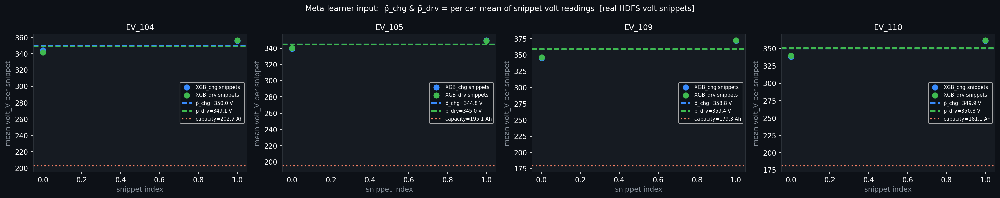

After training XGBoost, predictions on **validation snippets** are averaged **per car**:

$$\bar{p}_c^{chg} = \frac{1}{|S_c^{chg}|} \sum_{i \in S_c^{chg}} \hat{y}_i^{chg}, \qquad \bar{p}_c^{drv} = \frac{1}{|S_c^{drv}|} \sum_{i \in S_c^{drv}} \hat{y}_i^{drv}$$

Only cars with **both** modalities and valid ground truth form the meta-training set:

$$\mathcal{D}_{meta} = \left\{\, \left([\bar{p}_c^{chg},\ \bar{p}_c^{drv}],\ y_c\right) \mid c \in \mathcal{C}_{val},\ y_c > 0 \right\}$$

---

## Step 7 — EnsembleNN (Meta-Learner)

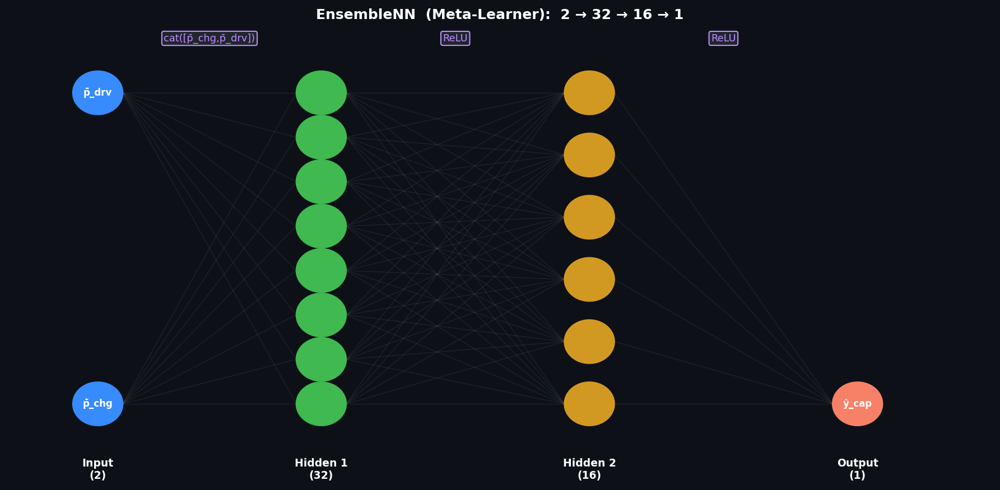

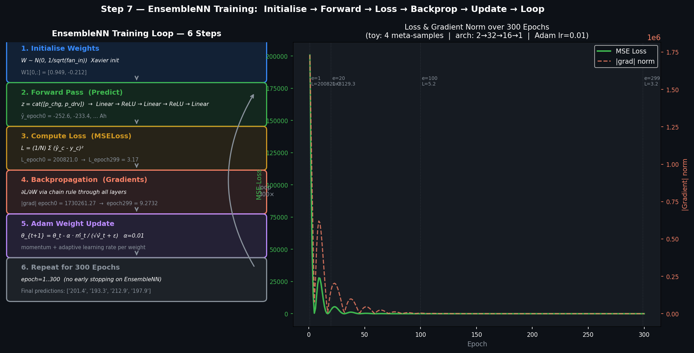

A small **3-layer MLP** fuses the two XGBoost predictions:

$$\mathbf{z}_c = [\bar{p}_c^{chg},\ \bar{p}_c^{drv}]^\top \in \mathbb{R}^2$$

$$\hat{y}_c^{nn} = \mathbf{W}_3\, \text{ReLU}\!\Big(\mathbf{W}_2\, \text{ReLU}\!\big(\mathbf{W}_1\, \mathbf{z}_c + \mathbf{b}_1\big) + \mathbf{b}_2\Big) + b_3$$

| Layer | Dimensions | Parameters |
|---|---|---|
| Linear 1 | $2 \to 32$ | $W_1 \in \mathbb{R}^{32\times2}$, $b_1 \in \mathbb{R}^{32}$ |
| ReLU | — | — |
| Linear 2 | $32 \to 16$ | $W_2 \in \mathbb{R}^{16\times32}$, $b_2 \in \mathbb{R}^{16}$ |
| ReLU | — | — |
| Linear 3 | $16 \to 1$ | $W_3 \in \mathbb{R}^{1\times16}$, $b_3 \in \mathbb{R}$ |

Total trainable parameters: $32\cdot2+32 + 16\cdot32+16 + 1\cdot16+1 = \mathbf{657}$

### Training Loop — 6 Steps

#### Step 1 — Initialise Weights (Xavier / Kaiming)

PyTorch `nn.Linear` initialises weights with **Kaiming uniform** by default:

$$W \sim \mathcal{U}\!\left(-\sqrt{\frac{6}{\text{fan\_in}}},\ +\sqrt{\frac{6}{\text{fan\_in}}}\right)$$

This ensures activations start with unit variance, preventing vanishing/exploding gradients.

#### Step 2 — Forward Pass (Predict)

$$\hat{y}_c = f_\theta(\bar{p}_c^{chg},\ \bar{p}_c^{drv})$$

Inputs $[\bar{p}_c^{chg},\ \bar{p}_c^{drv}]$ flow through Linear→ReLU→Linear→ReLU→Linear. Output is the predicted capacity in Ah.

#### Step 3 — Compute Loss (MSELoss)

$$\mathcal{L} = \frac{1}{N}\sum_{c=1}^{N}\left(\hat{y}_c - y_c\right)^2$$

With $N = $ number of meta-samples (≈ 2–4 validation cars in this project).

#### Step 4 — Backpropagation (Gradient Calculation)

Chain rule applied backwards through every layer:

$$\frac{\partial\mathcal{L}}{\partial W_1} = \frac{\partial\mathcal{L}}{\partial\hat{y}} \cdot \frac{\partial\hat{y}}{\partial z_3} \cdot \frac{\partial z_3}{\partial a_2} \cdot \frac{\partial a_2}{\partial z_2} \cdot \frac{\partial z_2}{\partial a_1} \cdot \frac{\partial a_1}{\partial W_1}$$

ReLU gradient: $\partial\text{ReLU}(z)/\partial z = \mathbf{1}[z > 0]$ — zero for negative activations, one otherwise.

#### Step 5 — Adam Weight Update

Adam maintains a per-weight **momentum** $m_t$ and **adaptive scale** $v_t$:

$$m_t = \beta_1 m_{t-1} + (1-\beta_1)\nabla\mathcal{L}, \qquad v_t = \beta_2 v_{t-1} + (1-\beta_2)(\nabla\mathcal{L})^2$$

$$\hat{m}_t = \frac{m_t}{1-\beta_1^t}, \quad \hat{v}_t = \frac{v_t}{1-\beta_2^t} \qquad \text{(bias correction)}$$

$$\theta_{t+1} = \theta_t - \alpha \cdot \frac{\hat{m}_t}{\sqrt{\hat{v}_t} + \epsilon}, \qquad \alpha=0.01,\ \beta_1=0.9,\ \beta_2=0.999,\ \epsilon=10^{-8}$$

| Adam component | Purpose |
|---|---|
| $m_t$ (1st moment) | Smooths gradient direction — damps oscillation |
| $v_t$ (2nd moment) | Scales step by gradient magnitude — large grad → small step |
| Bias correction $\hat{m}, \hat{v}$ | Prevents under-sized steps in early epochs when $m, v \approx 0$ |

#### Step 6 — Repeat for 300 Epochs

```python
for epoch in range(300):          # no early stopping on EnsembleNN
    optimizer.zero_grad()         # clear accumulated gradients
    outputs = nn_model(t_chg, t_drv)
    loss = criterion(outputs, t_y)
    loss.backward()               # compute ∂L/∂θ for all params
    optimizer.step()              # θ ← θ - α·Adam(∇L)
```

---

### Worked Example — 1 Car, Epoch 1 (Simplified 2→2→1 Net)

> Full architecture is 2→32→16→1. Here we use **2→2→1** so every number is traceable by hand. The math is identical.

**Frozen starting weights (Step 1 — initialise):**

$$W_1 = \begin{bmatrix}0.5 & -0.3 \\ 0.2 & 0.8\end{bmatrix}, \quad b_1 = \begin{bmatrix}0\\0\end{bmatrix}, \qquad W_2 = \begin{bmatrix}0.6 & 0.4\end{bmatrix}, \quad b_2 = 0$$

**Input — EV_104 (Step 2 — forward pass):**

$$\mathbf{x} = \begin{bmatrix}p_{chg}\\p_{drv}\end{bmatrix} = \begin{bmatrix}175.0\\178.0\end{bmatrix} \text{ Ah}, \qquad y_{true} = 202.7 \text{ Ah}$$

Layer 1 — linear:

$$\mathbf{z}_1 = W_1\mathbf{x} + b_1 = \begin{bmatrix}0.5{\times}175 + (-0.3){\times}178\\0.2{\times}175 + 0.8{\times}178\end{bmatrix} = \begin{bmatrix}34.1\\177.4\end{bmatrix}$$

Layer 1 — ReLU (both values positive, so unchanged):

$$\mathbf{a}_1 = \text{ReLU}(\mathbf{z}_1) = \begin{bmatrix}34.1\\177.4\end{bmatrix}$$

Layer 2 — linear (output):

$$\hat{y} = W_2\,\mathbf{a}_1 + b_2 = 0.6{\times}34.1 + 0.4{\times}177.4 = 20.46 + 70.96 = \mathbf{91.42 \text{ Ah}}$$

**Step 3 — Loss:**

$$\mathcal{L} = (\hat{y} - y)^2 = (91.42 - 202.7)^2 = (-111.28)^2 = \mathbf{12{,}383.2}$$

> The large loss is expected at epoch 1 — the random weights give a prediction far from ground truth.

**Step 4 — Gradients (backpropagation):**

Start at the output, work backwards:

$$\frac{\partial\mathcal{L}}{\partial\hat{y}} = 2(\hat{y}-y) = 2(91.42-202.7) = \mathbf{-222.56}$$

Gradient of $W_2$ (output layer weights):

$$\frac{\partial\mathcal{L}}{\partial W_2} = \frac{\partial\mathcal{L}}{\partial\hat{y}} \cdot \mathbf{a}_1^\top = -222.56 \times \begin{bmatrix}34.1 & 177.4\end{bmatrix} = \begin{bmatrix}-7589.3 & -39482.1\end{bmatrix}$$

Gradient flowing back through $W_2$ into $\mathbf{a}_1$:

$$\frac{\partial\mathcal{L}}{\partial\mathbf{a}_1} = W_2^\top \cdot (-222.56) = \begin{bmatrix}0.6\\0.4\end{bmatrix} \times (-222.56) = \begin{bmatrix}-133.5\\-89.0\end{bmatrix}$$

ReLU gate — passes gradient only where $z_1 > 0$ (both neurons were active):

$$\frac{\partial\mathcal{L}}{\partial\mathbf{z}_1} = \frac{\partial\mathcal{L}}{\partial\mathbf{a}_1} \odot \mathbf{1}[z_1>0] = \begin{bmatrix}-133.5\\-89.0\end{bmatrix} \odot \begin{bmatrix}1\\1\end{bmatrix} = \begin{bmatrix}-133.5\\-89.0\end{bmatrix}$$

Gradient of $W_1$:

$$\frac{\partial\mathcal{L}}{\partial W_1} = \frac{\partial\mathcal{L}}{\partial\mathbf{z}_1} \otimes \mathbf{x}^\top = \begin{bmatrix}-133.5\\-89.0\end{bmatrix}\begin{bmatrix}175 & 178\end{bmatrix} = \begin{bmatrix}-23369 & -23769\\-15579 & -15846\end{bmatrix}$$

**Step 5 — Adam update (epoch 1, $t=1$, $m_0=v_0=0$):**

For $W_2$ (representative):

| Quantity | Formula | Value |
|---|---|---|
| gradient $g$ | — | $[-7589.3,\ -39482.1]$ |
| $m_1 = 0.9{\cdot}0 + 0.1{\cdot}g$ | 1st moment | $[-758.9,\ -3948.2]$ |
| $v_1 = 0.999{\cdot}0 + 0.001{\cdot}g^2$ | 2nd moment | $[57597,\ 1558840]$ |
| $\hat{m}_1 = m_1/(1-0.9^1)$ | bias-corrected | $[-7589.3,\ -39482.1]$ |
| $\hat{v}_1 = v_1/(1-0.999^1)$ | bias-corrected | $[5.76{\times}10^7,\ 1.56{\times}10^9]$ |
| $W_2^{new} = W_2 - 0.01\cdot\hat{m}/(\sqrt{\hat{v}}+\varepsilon)$ | update | $[0.61,\ 0.41]$ |

> **Key insight:** $\hat{m}_i / \sqrt{\hat{v}_i} \approx \text{sign}(g_i) = +1$ at $t=1$, so Adam always takes exactly one step of size $\alpha=0.01$ regardless of gradient magnitude. This is Adam's "normalising" effect in early epochs.

**After update:**

$$W_2: [0.60,\ 0.40] \;\longrightarrow\; [0.61,\ 0.41]$$

**Step 6 — Loop:** repeat Steps 2–5 for epochs 2 … 300. The loss drops from 12,383 → near zero as weights learn to combine $p_{chg}$ and $p_{drv}$ optimally.

---

## Step 8 — Final Ensemble Prediction (Inference)

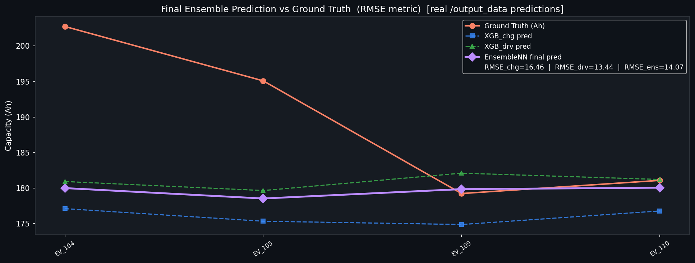

| Condition | Formula | Method label |
|---|---|---|
| Both modalities + NN available | $\hat{y}_c = \text{EnsembleNN}(\bar{p}_c^{chg},\ \bar{p}_c^{drv})$ | `Ensemble (Neural Network)` |
| Both modalities, no NN | $\hat{y}_c = \dfrac{\bar{p}_c^{chg} + \bar{p}_c^{drv}}{2}$ | `Ensemble (Simple Avg Fallback)` |
| Charging only | $\hat{y}_c = \bar{p}_c^{chg}$ | `XGB (Charging Only)` |
| Driving only | $\hat{y}_c = \bar{p}_c^{drv}$ | `XGB (Driving Only)` |

---

## Step 9 — Evaluation Metrics (RMSE)

$$\text{RMSE} = \sqrt{\frac{1}{N} \sum_{c=1}^{N} \left(\hat{y}_c - y_c\right)^2}$$

Four metrics computed and returned:

| Metric | Compared against |
|---|---|
| `rmse_charging` | XGB_chg predictions only |
| `rmse_driving` | XGB_drv predictions only |
| `rmse_ensemble` | EnsembleNN final prediction |
| `rmse_overall` | Final prediction across all cars |

---

## State of Health (SoH) Derivation

The predicted value is `actual_max_capacity_Ah`. SoH is derived as:

$$\text{SoH} = \frac{\hat{y}_c}{\text{nominal\_capacity\_Ah}} \times 100\%$$

**Example (`EV_066`):**

$$\text{SoH} = \frac{193.72}{210.0} \times 100\% \approx 92.2\%$$

---

## Model Versioning

Models are saved to HDFS under a timestamped directory to prevent overwriting active models:

```
/models/battery_health_ensemble/
├── latest.json                  ← {"version": "20240601_103000", "path": "..."}
└── v_20240601_103000/
    ├── xgb_model_chg.json
    ├── scaler_chg.joblib
    ├── xgb_model_drv.json
    ├── scaler_drv.joblib
    └── ensemble_nn.pth
```

Write operations are protected by a **read-write lock** (`model_lock`) to prevent race conditions between training and inference jobs running concurrently.

---

---

## XGBoost-Only Pipeline (`xgb_train.py`)

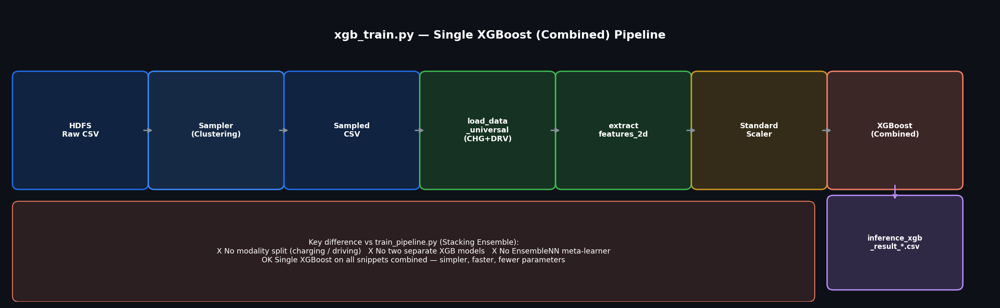

> **Source file:** `api/xgb_train.py`  
> **HDFS input:** `/raw_sample_data/sampled_training/` (same as ensemble)  
> **HDFS output:** `/output_data/inference_xgb_result_YYYYMMDD_HHMMSS.csv`  
> **Model saved to:** `/models/battery_health_xgb/v_<version>/`

This is a **simpler baseline** that trains a single XGBoost model on **all snippets combined** — no modality split, no meta-learner.

### Architecture difference vs Stacking Ensemble

| Aspect | `xgb_train.py` (XGB-Only) | `train_pipeline.py` (Stacking Ensemble) |
|---|---|---|
| Modality split | ✗ None — CHG + DRV together | ✓ Separate XGB_chg and XGB_drv |
| Number of XGB models | 1 | 2 |
| Meta-learner | ✗ None | ✓ EnsembleNN  $2 \to 32 \to 16 \to 1$ |
| Output column | `final_pred` | `final_ensemble_pred` |
| Model artefacts | `xgb_model_xgb.json`, `scaler_xgb.joblib` | `xgb_model_chg.json`, `xgb_model_drv.json`, `scaler_chg.joblib`, `scaler_drv.joblib`, `ensemble_nn.pth` |

### Training objective (identical to Step 5)

$$\hat{y}_i^{(K)} = \sum_{k=1}^{K} \eta \cdot f_k(\hat{\mathbf{x}}_i), \qquad \eta=0.05,\ K=300,\ \text{early stopping}=50$$

The input $\hat{\mathbf{x}}_i \in \mathbb{R}^{896}$ is the same flattened window as in the ensemble pipeline — no information is discarded; only the per-modality structure is ignored.

### Inference output schema (`inference_xgb_result_*.csv`)

| Column | Description |
|---|---|
| `car_id` | Vehicle ID (e.g. `EV_104`) |
| `max_mileage_km` | Maximum mileage seen in inference data |
| `prediction_method` | `"XGBoost (Combined)"` |
| `gt_capacity` | Ground truth `actual_max_capacity_Ah` |
| `final_pred` | Mean snippet-level XGBoost prediction per car |
| `error` | `final_pred − gt_capacity` |

---

## Model Comparison — XGB-Only vs Stacking Ensemble

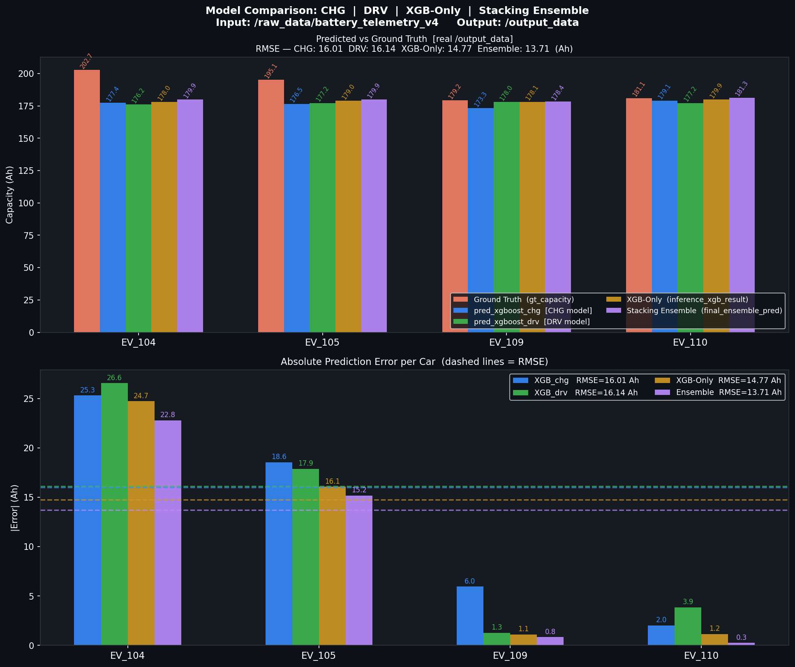

Real predictions are loaded from HDFS `/output_data/`:
- **XGB-Only:** latest `inference_xgb_result_*.csv` → column `final_pred`
- **Ensemble:** latest `inference_ensemble_result_*.csv` → column `final_ensemble_pred`

Focus vehicles: **EV_104, EV_105, EV_109, EV_110**

### When does Ensemble outperform XGB-Only?

The Ensemble benefits when:
- Charging and driving snippets give **diverging** predictions — the meta-learner can learn which modality is more reliable for a given vehicle.
- The training set is large enough (~10+ val cars) so the EnsembleNN has enough meta-training samples to generalise.

### Current limitation

With only ~11 total cars (≈ 2–4 validation cars after 80/20 split), the EnsembleNN meta-training set is tiny (≤ 4 samples). In this regime the simpler XGB-Only model may perform comparably or better because there is insufficient data to benefit from stacking.

**RMSE formula used in the comparison chart:**

$$\text{RMSE} = \sqrt{\frac{1}{|\mathcal{C}_{focus}|} \sum_{c \in \mathcal{C}_{focus}} \left(\hat{y}_c - y_c\right)^2}$$

---

*Generated from source: `src/AIAPI/api/train_pipeline.py`, `src/AIAPI/api/xgb_train.py`, `src/AIAPI/core/split_and_extract.py`, `src/AIAPI/core/nn.py`, `src/AIAPI/core/snippetbuffer.py`, `src/AIAPI/core/config.py`*

---

## Weak Points of XGBoost in This Project

### 1. Cannot extrapolate beyond training range

XGBoost is a **tree-based model** — it predicts by falling into a leaf that was seen during training. If a new car has battery capacity outside the training range, the model returns the edge leaf value and cannot extrapolate.

| Scenario | XGBoost behaviour | Neural network behaviour |
|---|---|---|
| Input inside training range | ✅ interpolates well | ✅ interpolates well |
| Input outside training range | ❌ clips to edge leaf | ⚠️ can extrapolate (but may be unreliable) |

**Example:** If all training cars have capacity 180–210 Ah and a new car has 160 Ah, XGBoost will always predict ≥ 180 Ah.

---

### 2. No temporal awareness — treats every snippet independently

XGBoost receives **one flattened feature vector per snippet** (window of sensor readings). It has no memory of previous snippets and cannot learn how battery degrades **over time** for the same car.

```
Snippet 1 (month 1)  →  XGBoost  →  prediction 1
Snippet 2 (month 6)  →  XGBoost  →  prediction 2   ← no connection to month 1
Snippet 3 (month 12) →  XGBoost  →  prediction 3
```

A **recurrent model (LSTM / Transformer)** could link these snippets and learn degradation trends.

---

### 3. Sensitive to feature engineering quality

XGBoost cannot learn raw time-series patterns directly. The current pipeline **flattens** a 10-step window into a feature vector. If the window size or feature selection is wrong, information is lost before XGBoost ever sees it.

---

### 4. Small dataset — high variance in tree structure

With only 11 cars and ~1000 total rows per car, individual noisy readings can strongly influence which splits are chosen. A single outlier segment can change a split threshold by a large margin.

---

### 5. EnsembleNN meta-learner is data-starved

The meta-learner (EnsembleNN) is trained on **≤ 4 validation car predictions**. A neural network with 657 parameters trained on 4 samples will overfit — it essentially memorises the 4 examples rather than learning a general fusion rule.

---

## What We Need to Improve with Data

### Priority 1 — More cars (most impactful)

| Current | Minimum recommended | Ideal |
|---|---|---|
| 11 cars | 50+ cars | 200+ cars |

More cars directly improves:
- XGBoost generalisation (more diverse split patterns)
- EnsembleNN meta-training set (currently ≤ 4 samples → needs 20+)
- Train/val split reliability (currently 80/20 on 11 = only ~2 val cars)

---

### Priority 2 — Longer time coverage per car

Each car should have data spanning its **full degradation lifecycle** — from new (100% capacity) to degraded (< 80% capacity). Currently if all cars are in a similar age range, XGBoost learns a narrow band of capacity values.

```
Ideal data distribution:
  Capacity (Ah)
  210 │ ████
  200 │ ████████
  190 │ ████████████
  180 │ ████████████████
  170 │ ██████████
  160 │ ████
      └─────────────────── cars
```

---

### Priority 3 — More segments per car

More driving/charging sessions per car → more snippets → more stable XGBoost predictions per car → more reliable $\bar{p}_c^{chg}$ and $\bar{p}_c^{drv}$ averages fed to the EnsembleNN.

**Current:** ~90 rows per car after sampling → ~9 snippets (10-step window)
**Target:** 500+ rows per car → 50+ snippets → mean is much more stable

---

### Priority 4 — Balanced modality coverage

Some cars may only have charging data or only driving data. For the EnsembleNN to learn a reliable fusion, all training cars should have **both modalities** with sufficient snippets each.

| Modality | Min snippets per car (recommended) |
|---|---|
| Charging segments | ≥ 20 |
| Driving segments | ≥ 20 |

---

### Priority 5 — Label quality (actual_max_capacity_Ah)

The ground truth label `actual_max_capacity_Ah` must be measured accurately. If this value is estimated (e.g. from OBD approximation rather than full charge cycle measurement), the model is trained on noisy labels and RMSE cannot go below the label noise floor.

---

### Summary table

| Weak point | Root cause | Data fix |
|---|---|---|
| Poor extrapolation | Tree structure clips predictions | More cars across wider capacity range |
| No temporal learning | Snippets treated independently | Add LSTM / Transformer on top |
| EnsembleNN overfits | Only 4 meta-training samples | 50+ cars → 10+ val cars |
| High variance splits | Only 11 cars, noisy data | More cars + more segments per car |
| Unreliable mean prediction | Too few snippets per car | 500+ rows per car |
| RMSE floor from label noise | Approximate capacity labels | Full charge-cycle capacity measurements |