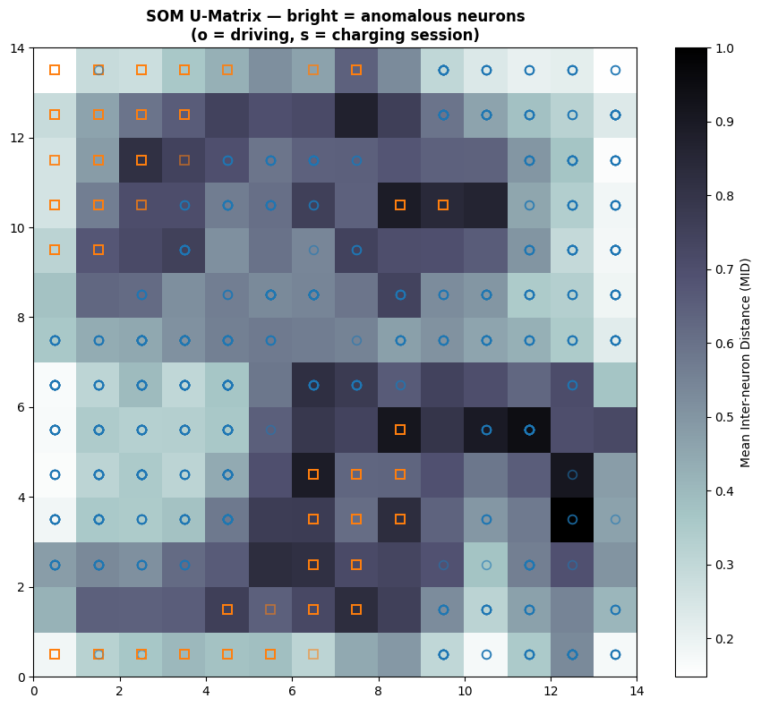
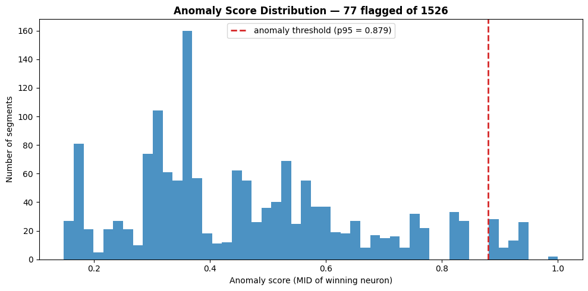
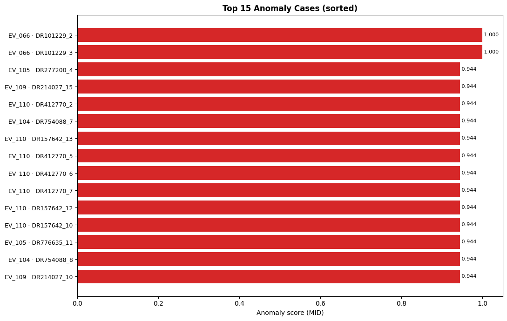
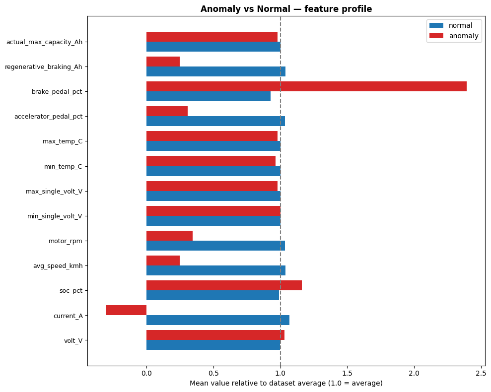
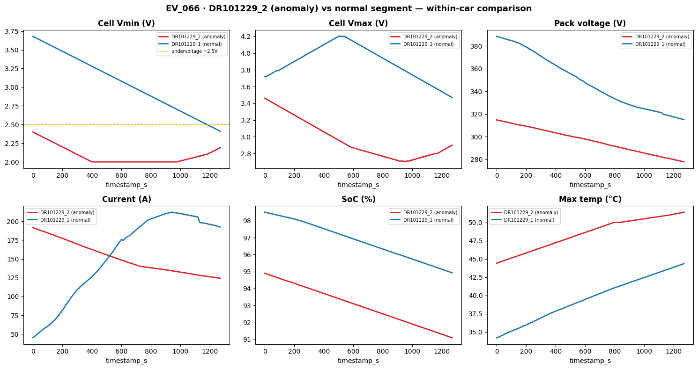

# SOM Anomaly Detection — Battery Telemetry

> **Created:** 2026-06-21  
> **Script:** [`som_anomaly_detection.py`](../data_quality/som_anomaly_detection.py)  
> **Technique:** Self-Organizing Map (SOM / Kohonen network) — unsupervised anomaly detection  
> **Adapted from:** the credit-card-fraud SOM (`machineLearningA-Z/DL.P2.Self_Organizing_Map(SOM)/SOM.py`)  
> **Dataset:** `App/dataset/battery_telemetry_v4/` — 11 cars, 200 609 rows → **1 526 session segments**

This document explains how we reuse the **fraud-detection SOM** idea to find
**anomalous battery sessions**, how to run it, the charts it produces, and the
ranked list of suspect cases.

---

## Table of Contents
1. [The idea — fraud SOM → battery anomalies](#1-the-idea--fraud-som--battery-anomalies)
2. [Setup](#2-setup)
3. [How to run](#3-how-to-run)
4. [Pipeline steps](#4-pipeline-steps)
5. [Charts & how to read them](#5-charts--how-to-read-them)
6. [Results — ranked anomaly cases](#6-results--ranked-anomaly-cases)
7. [How to interpret a flagged case](#7-how-to-interpret-a-flagged-case)
8. [When to use this](#8-when-to-use-this)
9. [Reference](#9-reference)

---

## 1  The idea — fraud SOM → battery anomalies

In the credit-card example, every **customer** is one row, scaled to `[0,1]` and
mapped onto a 2-D SOM grid. The **distance map** (U-Matrix) measures how far each
neuron's weights sit from its neighbours — the *Mean Inter-neuron Distance (MID)*.
Bright, isolated neurons = customers unlike everyone else = **frauds**.

We apply the exact same mechanism to battery telemetry:

| Fraud SOM | Battery SOM (this project) |
|---|---|
| 1 row = 1 customer | 1 row = 1 session segment `(car_id, id_segment)` |
| 15 application features | 26 features (mean + std of 13 signals) |
| High-MID neuron = fraud | High-MID neuron = **anomalous session** |
| `win_map` → fraud customers | `winner()` MID → ranked anomaly score |

> An "anomaly" here can mean a sensor fault, an abnormally degraded cell, or an
> unusual driving/charging pattern worth review — not literal fraud, but the same
> "this doesn't look like the rest" signal.

---

## 2  Setup

```bash
cd machineLearningEV          # repo root
source .venv/bin/activate
pip install minisom scikit-learn matplotlib pandas
```

Key libraries:
- **`minisom`** — lightweight SOM implementation (same as the reference)
- **`MinMaxScaler`** — scales every feature to `[0,1]` (SOM requires this)

---

## 3  How to run

```bash
source .venv/bin/activate
python App/src/AIAPI/data_quality/som_anomaly_detection.py
```

**Outputs:**
- `App/dataset/som_results/som_anomaly_ranking.csv` — every segment, sorted by anomaly score
- 4 PNG charts in `src/AIAPI/docs/images/som_0*.png`

---

## 4  Pipeline steps

| Step | What happens | Code |
|---|---|---|
| 1. Load | Read all 2 440 CSVs → 200 609 rows | `load_data()` |
| 2. Aggregate | Group by `(car_id, id_segment)` → **mean + std** of 13 signals = 1 526 vectors × 26 features | `build_segment_features()` |
| 3. Scale | `MinMaxScaler` → every feature in `[0,1]` | `sc.fit_transform(X)` |
| 4. Train SOM | `MiniSom 14×14`, σ=1.0, lr=0.5, 2 000 iterations | `train_som()` |
| 5. Score | anomaly score = **MID of the winning neuron** for each segment | `som.distance_map()` |
| 6. Flag & rank | threshold = **95th percentile** → top 5% are anomalies, sorted descending | — |

> Grid size auto-scales as `√(5·√n)` ≈ 14×14 for 1 526 samples (a common SOM rule of thumb).

---

## 5  Charts & how to read them

### 5.1  SOM U-Matrix (distance map)

Each cell is a neuron; **darker = higher MID = more anomalous**. Markers show
which sessions landed where (`o` = driving, `s` = charging). Sessions sitting on
dark cells are the suspects.



### 5.2  Anomaly score distribution

Histogram of every segment's score. The red dashed line is the p95 threshold —
everything to the right is flagged (**77 of 1 526**).



### 5.3  Top anomaly cases (sorted)

The 15 highest-scoring sessions. Red bars = above the 99th percentile (most
extreme). This is the **"sort by case to detect frauds"** view.



### 5.4  Anomaly vs normal feature profile

How flagged sessions differ from normal ones, per feature (1.0 = dataset
average). Bars far from 1.0 reveal *why* a session was flagged.



---

## 6  Results — ranked anomaly cases

Latest run flagged **77 anomalous segments** (top 5%). Score range:
min 0.148 · p95 0.879 · max 1.000.

### Top 10 cases

| Rank | Car | Segment | Session | Score |
|---:|---|---|---|---:|
| 1 | EV_066 | DR101229_2 | driving | 1.000 |
| 2 | EV_066 | DR101229_3 | driving | 1.000 |
| 3 | EV_105 | DR277200_4 | driving | 0.944 |
| 4 | EV_109 | DR214027_15 | driving | 0.944 |
| 5 | EV_110 | DR412770_2 | driving | 0.944 |
| 6 | EV_104 | DR754088_7 | driving | 0.944 |
| 7 | EV_110 | DR157642_13 | driving | 0.944 |
| 8 | EV_110 | DR412770_5 | driving | 0.944 |
| 9 | EV_110 | DR412770_6 | driving | 0.944 |
| 10 | EV_110 | DR412770_7 | driving | 0.944 |

### Anomalies per car

| Car | Flagged | Car | Flagged |
|---|---:|---|---:|
| EV_109 | 14 | EV_104 | 5 |
| EV_110 | 12 | EV_106 | 5 |
| EV_105 | 10 | EV_066 | 3 |
| EV_107 | 10 | EV_103 | 3 |
| EV_108 | 8 | EV_102 | 1 |
| EV_101 | 6 | | |

By session type: **41 charging** vs **36 driving** anomalies.

> Full ranking (all 1 526 segments + feature means) →
> `App/dataset/som_results/som_anomaly_ranking.csv`

---

## 7  How to interpret a flagged case

A high score means the session is **far from the learned "normal" map**. To
triage one:

1. Open `som_anomaly_ranking.csv`, find the `rank`/`car_id`/`id_segment`.
2. Compare its `*_mean` columns to the dataset average (chart 5.4).
3. Likely causes:
   - **Voltage/temperature out of band** → sensor fault or cell degradation
   - **Capacity far below peers** → genuine battery aging
   - **Very few rows (`n_rows`)** → truncated/partial session (data issue, e.g. EV_066)
   - **Extreme current/rpm** → abnormal driving

> SOM is **unsupervised** — it ranks "unusual", not "confirmed bad". Each flagged
> case needs a human (or a downstream rule) to confirm.

### Worked case study — `EV_066 / DR101229_2` (rank #1, score 1.000)

This is the single most anomalous segment in the whole dataset. Comparing it
against the **normal driving baseline** (1 070 segments, 141 572 rows) and against
the *previous* segment of the same trip (`DR101229_1`):



| Signal | DR101229_2 (anomaly) | Normal driving | Verdict |
|---|---:|---:|---|
| **min_single_volt_V** | **2.08** (floored at 2.0 for **46%** of rows) | 3.98 | 🔴 critical cell under-voltage |
| **max_single_volt_V** | 2.96 (min 2.70) | 4.14 | 🔴 even the *strongest* cell is collapsing |
| **volt_V** (pack) | 296 (falls 314→278) | 362 | 🔴 pack voltage sagging hard |
| **current_A** | **151** (up to 191) | 67 | 🔴 ~2.3× normal draw |
| **soc_pct** | 93% | 66% | ⚠️ high SoC yet voltage collapsing |
| accelerator_pedal_pct | 14% | 37% | ⚠️ low pedal but high current |

**Why it's flagged:** the physics don't add up. At **93% SoC** a healthy pack
should sit near full voltage, but here the **weakest cell is pinned at the 2.0 V
floor** while the pack draws **2–3× the normal current** at only 14% accelerator.
A high-SoC battery whose cells sag to the under-voltage limit under load is the
classic signature of a **severely degraded / failing cell** (or a voltage-sensor
fault). This is exactly the kind of "looks wrong vs everyone else" pattern the SOM
isolates — and notably one that a simple min/max GX rule would *miss*, because
each individual value (2.0 V, 151 A, 93%) is within its allowed range; it is the
**combination** that is abnormal.

> Contrast with `DR101229_1` (the immediately preceding segment, *not* flagged):
> its cells stay 2.4–3.6 V — low, but not floored — so the SOM ranked it less
> extreme.

---

## 8  When to use this

| Situation | Action |
|---|---|
| **Before training** | Drop or down-weight top-anomaly segments to reduce label noise |
| **New data batch** | Re-run; new high-MID sessions = data to inspect |
| **Pair with Great Expectations** | GX catches *rule* violations; SOM catches *pattern* outliers GX can't express |
| **Per-car health** | Cars with many flags (EV_109, EV_110) may have sensor/aging issues |

---

## 9  Reference

- **SOM reference implementation:** `machineLearningA-Z/DL.P2.Self_Organizing_Map(SOM)/SOM.py`
- **MiniSom:** https://github.com/JustGlowing/minisom
- **This repo:**
  - Script → [data_quality/som_anomaly_detection.py](../data_quality/som_anomaly_detection.py)
  - Ranking CSV → `App/dataset/som_results/som_anomaly_ranking.csv`
  - Companion guides → [great_expectations_guide.md](great_expectations_guide.md) · [fg_data_profiling_guide.md](fg_data_profiling_guide.md)
