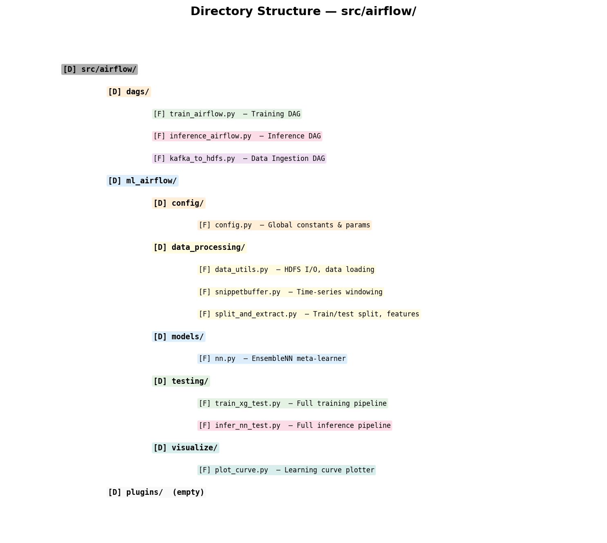
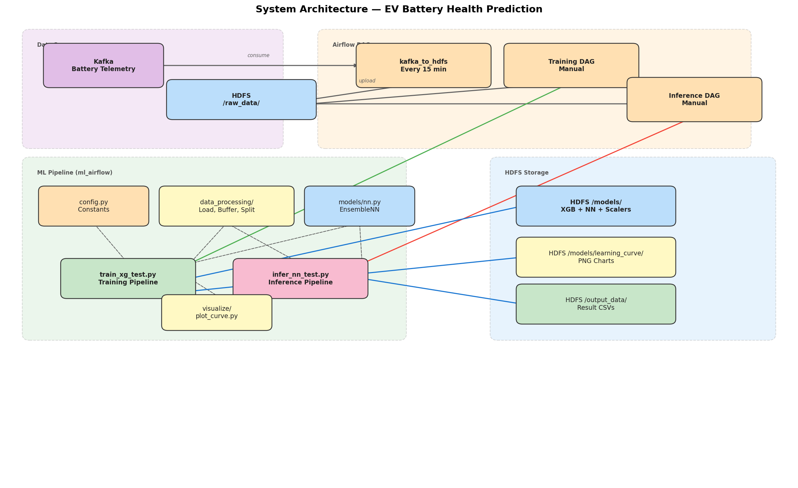
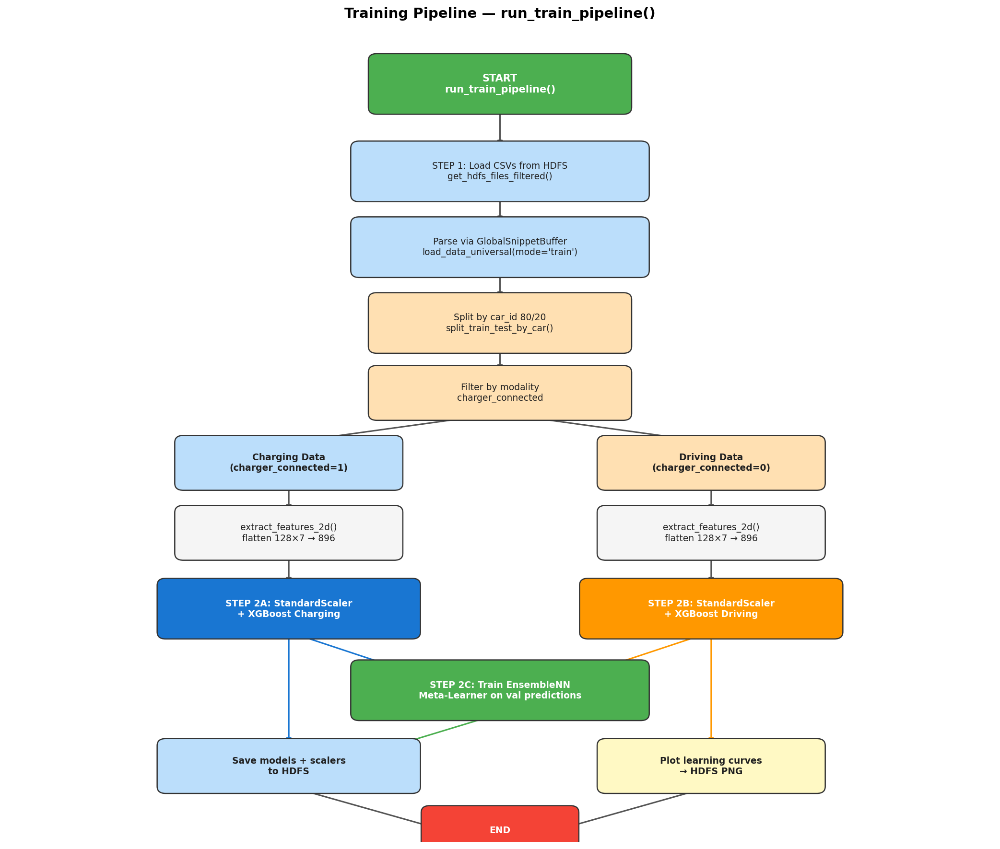
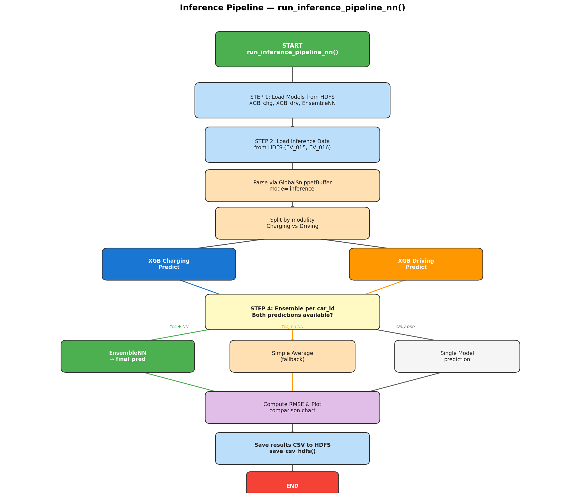
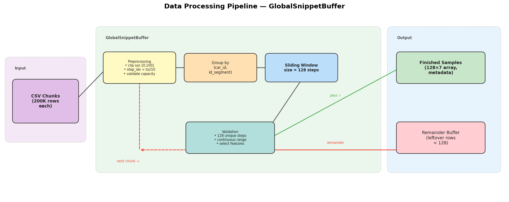
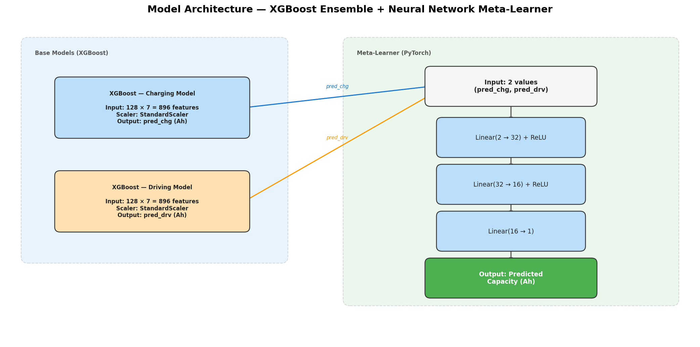
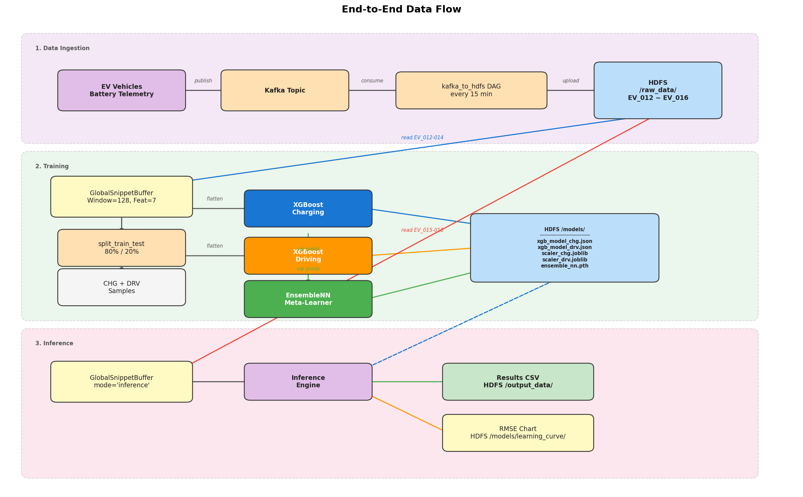
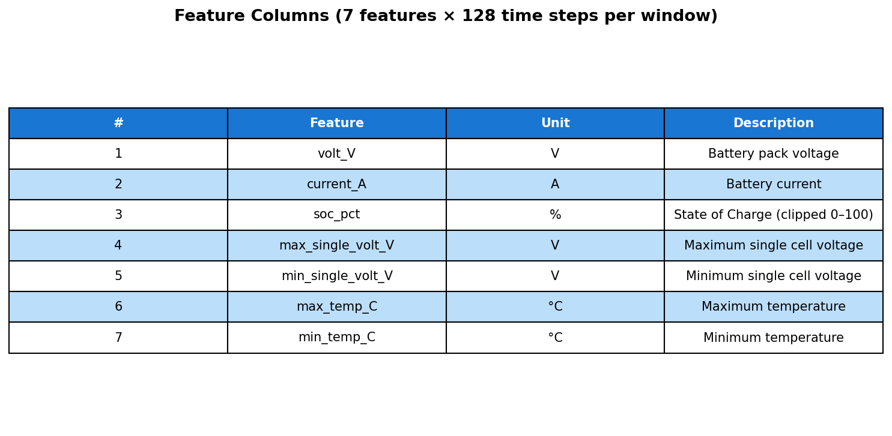

# ML Airflow Codebase Analysis

## 1. Project Overview

This project implements an **EV Battery Health Prediction System** using an ensemble of XGBoost models combined with a Neural Network meta-learner. The system is orchestrated by **Apache Airflow** and uses **HDFS** for distributed data storage.

**Goal:** Predict battery `actual_max_capacity_Ah` (State of Health) from time-series telemetry data collected during **charging** and **driving** modes.

---

## 2. Directory Structure



---

## 3. Architecture Diagram



---

## 4. Training Pipeline Flow



---

## 5. Inference Pipeline Flow



---

## 6. Data Processing Pipeline (GlobalSnippetBuffer)



---

## 7. Model Architecture



---

## 8. Airflow DAGs Overview

| DAG | Task(s) | Schedule | Timeout |
|-----|---------|----------|---------|
| `kafka_to_hdfs` | `read_kafka_save_csv` → `upload_csv_to_hdfs` | Every 15 min | Default |
| `ev_battery_training_dag` | `train_and_save_model` | Manual (`None`) | 6 hours |
| `ev_battery_inference_dag` | `load_model_and_predict` | Manual (`None`) | 4 hours |

---

## 9. Module Function Reference

### 9.1 `config/config.py`
| Constant | Value | Description |
|----------|-------|-------------|
| `HDFS_URL` | `http://hc1-c-0003u...:9870` | HDFS NameNode endpoint |
| `HDFS_USER` | `hdfs` | HDFS authentication user |
| `WINDOW_SIZE` | `128` | Time-series sliding window size |
| `FEATURE_COLS_CHG` | 7 columns | Features for charging mode |
| `FEATURE_COLS_DRV` | 7 columns | Features for driving mode |
| `DEVICE` | auto-detect | CUDA if available, else CPU |

### 9.2 `data_processing/data_utils.py`

| Function | Parameters | Returns | Description |
|----------|-----------|---------|-------------|
| `load_data_universal()` | `client`, `file_paths`, `mode` | `list[(ndarray, dict)]` | Downloads CSVs from HDFS, processes through `GlobalSnippetBuffer`, returns windowed samples |
| `get_hdfs_files_filtered()` | `client`, `directory`, `min_date_str`, `limit` | `list[str]` | Lists and filters CSV files on HDFS by date |
| `filter_by_modality()` | `dataset`, `is_charge` | `list` | Splits dataset into charging/driving subsets |
| `save_csv_hdfs()` | `data_rows`, `header`, `filename_prefix` | `None` | Writes CSV results to HDFS with timestamp |
| `save_artifacts_to_hdfs()` | `client`, `hdfs_dir`, `suffix`, `model`, `scaler` | `None` | Saves XGBoost model (JSON) + StandardScaler (joblib) to HDFS |
| `load_artifacts_from_hdfs()` | `client`, `hdfs_dir`, `suffix` | `(model, scaler)` | Loads XGBoost model + scaler from HDFS |
| `print_dataset_logs()` | `dataset`, `name` | `None` | Prints car/segment breakdown for debugging |

### 9.3 `data_processing/snippetbuffer.py`

| Class / Method | Description |
|----------------|-------------|
| `GlobalSnippetBuffer.__init__(mode)` | Initialize buffer with `train` or `inference` mode |
| `GlobalSnippetBuffer.add_chunk(df_chunk, file_path)` | Accumulates rows, yields complete 128-step windows. Returns `list[(ndarray, dict)]` |

**Preprocessing steps:**
1. Clip `soc_pct` to `[0, 100]`
2. Compute `step_idx` from `timestamp_s` (10s intervals)
3. Validate `actual_max_capacity_Ah` (required in train mode, optional in inference)
4. Group by `(car_id, id_segment)`
5. Select feature columns based on `charger_connected` flag
6. Extract non-overlapping windows of 128 consecutive time steps

### 9.4 `data_processing/split_and_extract.py`

| Function | Description |
|----------|-------------|
| `split_train_test_by_car(dataset, train_ratio=0.8)` | Splits at car level (not sample level) to prevent data leakage |
| `extract_features_3d(dataset)` | Returns `(N, 128, 7)` array + labels — for sequence models |
| `extract_features_2d(dataset)` | Returns `(N, 896)` array + labels — for XGBoost (flattened) |

### 9.5 `models/nn.py`

| Class | Architecture | Description |
|-------|-------------|-------------|
| `EnsembleNN` | `Linear(2→32) → ReLU → Linear(32→16) → ReLU → Linear(16→1)` | Meta-learner that combines charging & driving XGBoost predictions |

### 9.6 `visualize/plot_curve.py`

| Function | Description |
|----------|-------------|
| `plot_learning_curve(client, evals_result, model_name, hdfs_save_path)` | Plots XGBoost train/val RMSE curves and saves PNG to HDFS |

### 9.7 `testing/train_xg_test.py` — `run_train_pipeline()`

| Step | Description |
|------|-------------|
| **Step 1** | Load CSV data from HDFS for `EV_012, EV_013, EV_014`. Split 80/20 by car. |
| **Step 2A** | Train XGBoost on **charging** data (StandardScaler → XGBoost, 300 rounds, lr=0.0001) |
| **Step 2B** | Train XGBoost on **driving** data (same hyperparams) |
| **Step 2C** | Train `EnsembleNN` meta-learner on validation-set XGBoost predictions (Adam, lr=0.01, 300 epochs) |
| **Step 3** | Save all artifacts (2 XGBoost models, 2 scalers, 1 NN `.pth`) to HDFS |

### 9.8 `testing/infer_nn_test.py` — `run_inference_pipeline_nn()`

| Step | Description |
|------|-------------|
| **Step 1** | Load all models + scalers from HDFS |
| **Step 2** | Load inference data for `EV_015, EV_016` |
| **Step 3** | Predict with both XGBoost models |
| **Step 4** | Ensemble via NN (or fallback to average), compute RMSE, plot comparison chart, save CSV |

---

## 10. End-to-End Data Flow



---

## 11. Feature Columns



> **Note:** The code contains a commented-out `FEATURE_COLS_DRV` with additional driving features (`payload_kg`, `avg_speed_kmh`, `hvac_active`, `motor_rpm`), but these are currently disabled.

---

## 12. Key Design Decisions

| Decision | Rationale |
|----------|-----------|
| **Split by car (not by sample)** | Prevents data leakage — a car's samples are either all in train or all in test |
| **Separate models for Charging vs Driving** | Different physical behaviors produce different signal patterns |
| **Meta-Learner NN for ensemble** | Learns optimal weighting of the two XGBoost predictions instead of naive averaging |
| **GlobalSnippetBuffer** | Handles streaming/chunked CSV reads and assembles complete time windows across chunk boundaries |
| **HDFS for all storage** | Fits into Hadoop ecosystem; models, data, and charts all stored on HDFS |
| **10-second step intervals** | `timestamp_s // 10` creates uniform time steps; window of 128 = ~21 minutes of data |

---

## 13. Model Hyperparameters

### XGBoost (Charging & Driving)
```
booster        : gbtree
learning_rate  : 0.0001
objective      : reg:squarederror
num_boost_round: 300
early_stopping : 50 rounds
seed           : 168
```

### EnsembleNN (Meta-Learner)
```
architecture : Linear(2→32→16→1) with ReLU
optimizer    : Adam (lr=0.01)
loss         : MSELoss
epochs       : 300
```

---

## 14. Dependency Graph

The internal module dependencies are:

```
config.py ──────► snippetbuffer.py ──────► data_utils.py
                                               │
config.py ──────► data_utils.py                │
                                               ▼
nn.py ──────────────────────────────► train_xg_test.py ◄──── plot_curve.py
                                               │
nn.py ──────────────────────────────► infer_nn_test.py
                                               │
split_and_extract.py ──────────────► train_xg_test.py
split_and_extract.py ──────────────► infer_nn_test.py
```

**External Libraries:**
- `torch` / `torch.nn` — Neural network (EnsembleNN)
- `xgboost` — Gradient boosting models
- `sklearn` — StandardScaler, metrics
- `pandas` / `numpy` — Data manipulation
- `hdfs` (InsecureClient) — HDFS access
- `matplotlib` — Visualization
- `apache-airflow` — DAG orchestration
- `kafka-python` — Kafka consumer

---

*Generated by `generate_diagrams.py` — re-run to update images.*
