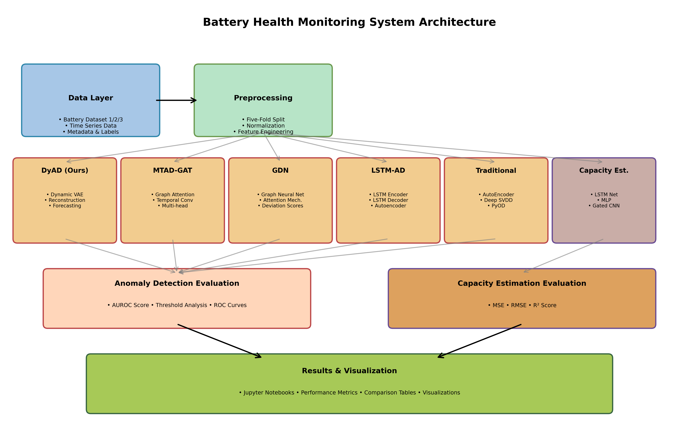
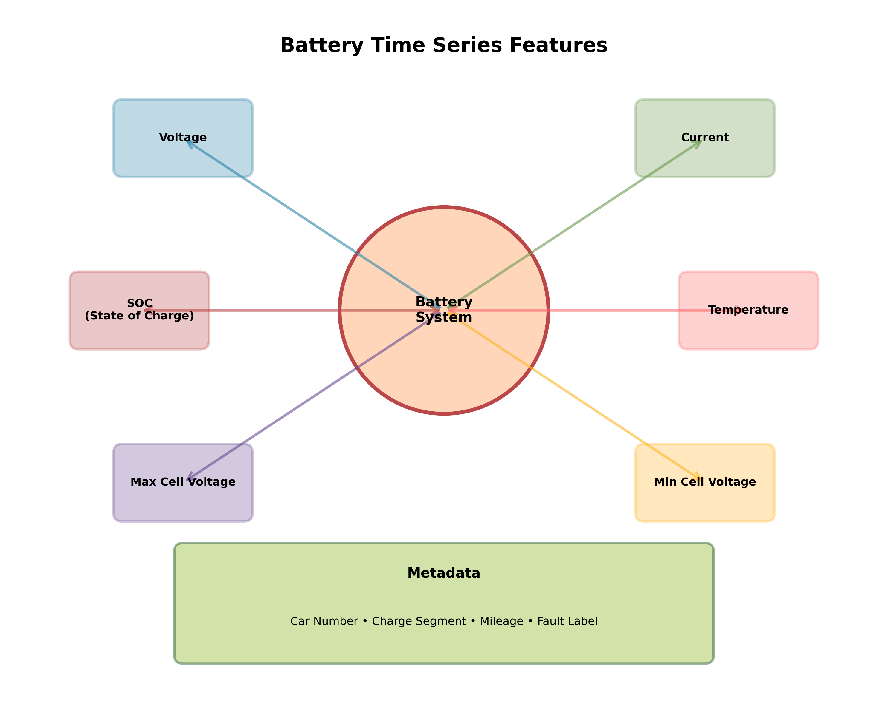
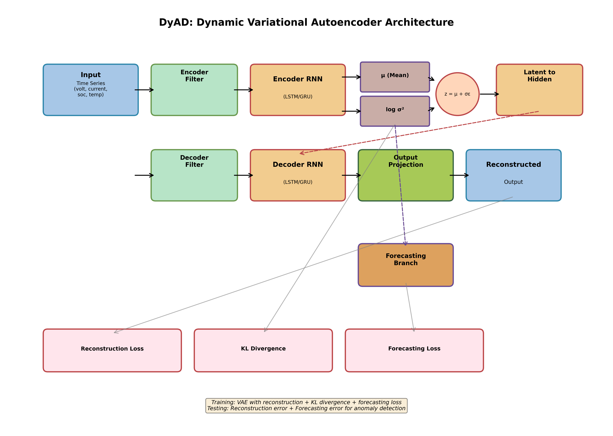
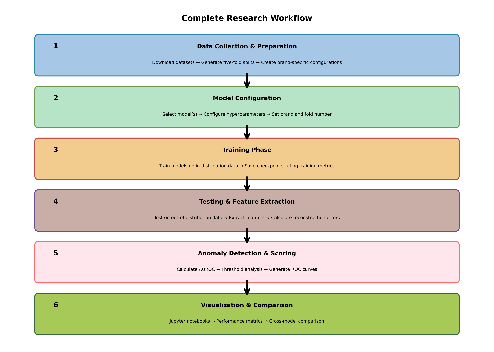
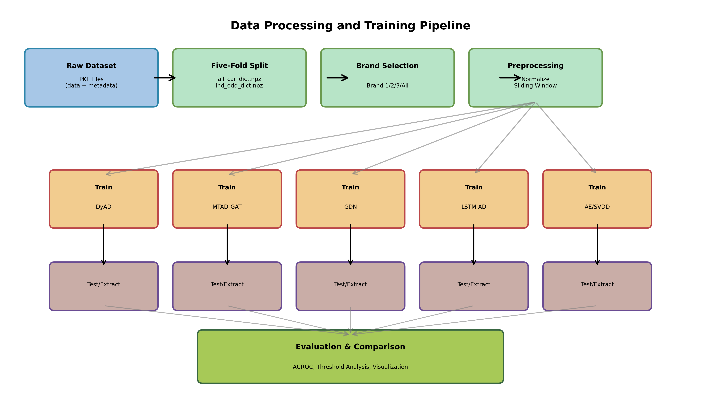
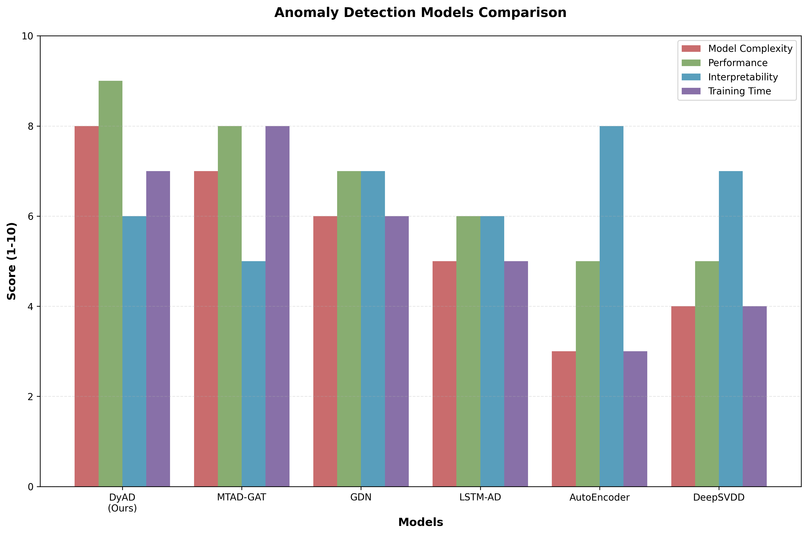

# Battery Health Monitoring System - Architecture & Analysis

## 📋 Table of Contents
1. [Project Overview](#project-overview)
2. [System Architecture](#system-architecture)
3. [Dataset Structure](#dataset-structure)
4. [Implemented Models](#implemented-models)
5. [Data Processing Pipeline](#data-processing-pipeline)
6. [Anomaly Detection Methods](#anomaly-detection-methods)
7. [Capacity Estimation](#capacity-estimation)
8. [Evaluation Metrics](#evaluation-metrics)
9. [Usage Guide](#usage-guide)
10. [File Structure](#file-structure)

---

## 🎯 Project Overview

This project implements a comprehensive battery health monitoring system for electric vehicles, focusing on:
- **Battery Health Anomaly Detection**: Identifying abnormal battery behavior using multiple deep learning approaches
- **Capacity Estimation**: Predicting battery capacity degradation over time
- **Multi-Brand Analysis**: Supporting analysis across different vehicle brands (Brand 1, 2, 3, and combined)
- **Comparative Study**: Benchmarking 6 different anomaly detection algorithms

### Research Context
This is a research codebase from a NeurIPS 2023 dataset paper, implementing state-of-the-art time series anomaly detection methods specifically tailored for battery health monitoring in electric vehicles.

### Key Features
- ✅ Five-fold cross-validation for robust evaluation
- ✅ Support for multi-brand battery systems
- ✅ Multiple anomaly detection algorithms (DyAD, MTAD-GAT, GDN, LSTM-AD, AE, SVDD)
- ✅ Capacity estimation with multiple ML models
- ✅ Comprehensive evaluation notebooks
- ✅ MSL and SMAP spacecraft dataset support (for comparison)

---

## 🏗️ System Architecture

### Overall Architecture



The system follows a layered architecture:

1. **Data Layer**: Raw battery datasets from 3 different brands
   - Time series data: voltage, current, SOC, temperature
   - Metadata: car numbers, fault labels, mileage
   - Charge segment information

2. **Preprocessing Layer**: Data preparation and organization
   - Five-fold train-test split generation
   - Normalization and feature engineering
   - Sliding window generation for time series

3. **Model Layer**: Multiple anomaly detection approaches
   - **DyAD (Proposed)**: Dynamic Variational Autoencoder
   - **MTAD-GAT**: Multi-scale Temporal Attention with Graph Attention
   - **GDN**: Graph Deviation Network
   - **LSTM-AD**: LSTM-based Autoencoder
   - **Traditional Methods**: AutoEncoder and Deep SVDD
   - **Capacity Estimation**: LSTM, MLP, Gated CNN models

4. **Evaluation Layer**: Performance assessment
   - AUROC score calculation
   - Threshold analysis (robust and average methods)
   - ROC curve generation
   - MSE/RMSE/R² for capacity estimation

5. **Results Layer**: Visualization and reporting
   - Jupyter notebooks for analysis
   - Performance comparison tables
   - Visualization plots

---

## 📊 Dataset Structure

### Battery Time Series Features



### Data Organization

```
data/
├── battery_dataset1/          # Brand 1 vehicles
│   ├── data/                  # Time series PKL files
│   └── label/                 # Anomaly labels
├── battery_dataset2/          # Brand 2 vehicles
│   ├── data/
│   └── label/
├── battery_dataset3/          # Brand 3 vehicles
│   ├── data/
│   └── label/
└── five_fold_train_test_split.ipynb
```

### PKL File Format

Each `.pkl` file contains a tuple:
1. **First element**: Charging time series data
   - Voltage (volt)
   - Current
   - State of Charge (SOC)
   - Maximum single cell voltage
   - Minimum single cell voltage
   - Maximum temperature

2. **Second element**: Metadata
   - Fault label (0: normal, 1: anomaly)
   - Car number (vehicle ID)
   - Charge segment number
   - Mileage information

### Generated Path Files

After running `five_fold_train_test_split.ipynb`:
- **`all_car_dict.npz.npy`**: Maps car numbers to their data file paths
- **`ind_odd_dict1/2/3.npz.npy`**: Five-fold splits for each brand
  - In-distribution (normal) car numbers
  - Out-of-distribution (test) car numbers

---

## 🤖 Implemented Models

### 1. DyAD (Dynamic Variational Autoencoder) - Proposed Method



**Architecture Components:**
- **Encoder RNN**: Processes input time series into latent space
- **Encoder Filter**: Feature selection layer
- **Latent Space**: Mean (μ) and log-variance (log σ²) representation
- **Reparameterization**: z = μ + σε (enables backpropagation)
- **Decoder RNN**: Reconstructs input from latent representation
- **Forecasting Branch**: Predicts future values from latent representation

**Loss Functions:**
1. **Reconstruction Loss**: MSE between input and reconstructed output
2. **KL Divergence**: Regularizes latent space to follow Gaussian distribution
3. **Forecasting Loss**: MSE between predicted and actual future values

**Key Features:**
- Combines reconstruction and forecasting for robust anomaly detection
- Variable-length sequence support with padding
- Bidirectional RNN option
- Noise injection during training for regularization

**Files:**
- `DyAD/model/dynamic_vae.py`: Model architecture
- `DyAD/train.py`: Training logic
- `DyAD/extract.py`: Feature extraction
- `DyAD/evaluate.py`: Anomaly detection using SVDD

### 2. MTAD-GAT (Multi-scale Temporal Attention with Graph Attention)

**Key Components:**
- **Graph Attention Networks (GAT)**: Captures inter-sensor relationships
- **Temporal Convolutional Networks**: Multi-scale temporal feature extraction
- **Attention Mechanism**: Focuses on important time steps and features
- **GATv2 Support**: Option to use improved GAT variant

**Strengths:**
- Excellent at capturing complex sensor dependencies
- Multi-scale temporal patterns
- Interpretable attention weights

**Files:**
- `mtad-gat-pytorch-modified/mtad_gat.py`: Model implementation
- `mtad-gat-pytorch-modified/train.py`: Training script
- `mtad-gat-pytorch-modified/predict.py`: Prediction and anomaly scoring

### 3. GDN (Graph Deviation Network)

**Architecture:**
- **Graph Structure Learning**: Learns optimal sensor connectivity
- **Graph Neural Network**: Propagates information across sensor graph
- **Attention-based Aggregation**: Weighted combination of neighbor features
- **Deviation Scoring**: Measures deviation from learned normal patterns

**Strengths:**
- Automatic graph structure discovery
- Effective for multivariate time series
- Fast inference

**Files:**
- `GDN_battery/models/GDN.py`: GDN model
- `GDN_battery/models/graph_layer.py`: Graph neural network layers
- `GDN_battery/train.py`: Training procedure
- `GDN_battery/test.py`: Testing and evaluation

### 4. LSTM-AD (LSTM Autoencoder)

**Architecture:**
- **LSTM Encoder**: Encodes time series into compressed representation
- **LSTM Decoder**: Reconstructs original sequence
- **Bottleneck Layer**: Forces information compression

**Strengths:**
- Simple and interpretable
- Good baseline for sequence anomaly detection
- Handles variable-length sequences well

**Files:**
- `Recurrent-Autoencoder-modify/graphs/`: Model architectures
- `Recurrent-Autoencoder-modify/agents/`: Training agents
- `Recurrent-Autoencoder-modify/main.py`: Entry point

### 5. Traditional Methods (AE & Deep SVDD)

**AutoEncoder:**
- Standard feedforward autoencoder
- MSE reconstruction loss
- PyOD implementation with bug fixes

**Deep SVDD (Support Vector Data Description):**
- One-class classification approach
- Learns minimal hypersphere containing normal data
- Anomaly score based on distance from hypersphere center

**Files:**
- `AE_and_SVDD/traditional_methods.py`: Both implementations

---

## 🔄 Data Processing Pipeline

### Complete Workflow



### Detailed Data Flow



### Processing Steps

#### Step 1: Data Preparation
```bash
cd data
# Run Jupyter notebook to generate splits
jupyter notebook five_fold_train_test_split.ipynb
```

**Outputs:**
- `five_fold_utils/all_car_dict.npz.npy`
- `five_fold_utils/ind_odd_dict1.npz.npy` (for Brand 1)
- `five_fold_utils/ind_odd_dict2.npz.npy` (for Brand 2)
- `five_fold_utils/ind_odd_dict3.npz.npy` (for Brand 3)

#### Step 2: Brand Selection

Each model has a dataset configuration file where you specify:
- Which brand to use (1, 2, 3, or all)
- Which fold (0, 1, 2, 3, 4) for cross-validation
- Path to the `ind_odd_dict` file

**Configuration Locations:**
- DyAD: `DyAD/model/dataset.py` → `ind_ood_car_dict_path`
- MTAD-GAT: Command-line argument `--battery_brand123`
- GDN: `GDN_battery/datasets/TimeDataset.py` → `ind_ood_car_dict`
- LSTM-AD: `Recurrent-Autoencoder-modify/datasets/battery.py`
- AE/SVDD: `AE_and_SVDD/traditional_methods.py`

#### Step 3: Preprocessing

**Normalization:**
- Min-Max scaling or Z-score normalization
- Applied per-feature across training set
- Test set normalized using training statistics

**Sliding Window:**
- Window size: 127 time steps (configurable)
- Overlap: Varies by model
- Creates input sequences for temporal models

**Padding:**
- Variable-length sequences padded to max length
- Padding mask used in attention mechanisms

#### Step 4: Training

Each model trains on in-distribution (normal) data:
- **Input**: Normal battery charging sequences
- **Objective**: Learn normal behavior patterns
- **Output**: Trained model checkpoints

#### Step 5: Feature Extraction / Testing

- **Extract latent representations** (DyAD, LSTM-AD)
- **Calculate reconstruction errors**
- **Compute anomaly scores**
- **Generate predictions** on test set

#### Step 6: Evaluation

- **AUROC Calculation**: Using reconstruction errors as anomaly scores
- **Threshold Methods**:
  - Average: Direct use of reconstruction errors
  - Robust: Apply additional processing for robustness
- **ROC Curve Generation**: For visualization

---

## 🔍 Anomaly Detection Methods

### Model Comparison



### Detection Approaches

#### 1. Reconstruction-Based (DyAD, LSTM-AD, AE)

**Principle:** Normal data should be reconstructed accurately, anomalies should have high reconstruction error.

**Process:**
1. Train model on normal data
2. Reconstruct test sequences
3. Calculate error: `E = ||X - X̂||²`
4. High error → Anomaly

**Advantages:**
- Intuitive and interpretable
- Works well for structured anomalies
- No need for anomaly labels during training

#### 2. Forecasting-Based (DyAD)

**Principle:** Normal patterns are predictable, anomalies deviate from predictions.

**Process:**
1. Predict next time step from history
2. Compare prediction with actual
3. Large deviation → Anomaly

**Advantages:**
- Captures temporal dependencies
- Sensitive to subtle changes
- Complements reconstruction

#### 3. Graph-Based (MTAD-GAT, GDN)

**Principle:** Anomalies break expected sensor correlations.

**Process:**
1. Learn graph structure (sensor relationships)
2. Detect deviations from learned patterns
3. Consider both temporal and inter-sensor anomalies

**Advantages:**
- Captures multivariate dependencies
- Robust to sensor-specific noise
- Interpretable via attention weights

#### 4. One-Class Classification (Deep SVDD)

**Principle:** Learn compact representation of normal data.

**Process:**
1. Map normal data to hypersphere
2. Calculate distance from hypersphere center
3. Large distance → Anomaly

**Advantages:**
- Theoretically grounded
- Effective for well-separated classes
- Robust to outliers during training

### Anomaly Score Calculation

#### Average Method (Simple)
```python
anomaly_score = reconstruction_error_mean
```

#### Robust Method (With Threshold)
```python
# Apply SPOT/DSPOT threshold method
threshold = calculate_threshold(validation_errors)
anomaly_score = max(0, reconstruction_error - threshold)
```

---

## 📈 Capacity Estimation

### Problem Statement

Predict remaining battery capacity based on historical charging behavior.

### Models Implemented

#### 1. LSTM Network
```python
class LSTMNet(nn.Module):
    - Encoder: LSTM layers to process time series
    - Decoder: Fully connected layers for capacity prediction
    - Output: Single value (capacity)
```

#### 2. MLP (Multi-Layer Perceptron)
```python
class MLP(nn.Module):
    - Flattens time series
    - Multiple fully connected layers
    - Direct regression to capacity
```

#### 3. Gated CNN
```python
class GatedCNN(nn.Module):
    - 1D convolutions for temporal features
    - Gating mechanism for feature selection
    - Pooling and FC layers for prediction
```

#### 4. Traditional ML (Baselines)
- **XGBoost**: Gradient boosted trees
- **Random Forest**: Ensemble of decision trees
- **Gradient Boosting**: Sequential boosting

### Training Process

```bash
cd capacity_estimation
python main.py --fold_num 0 --model LSTMNet --epochs 10
```

### Evaluation Metrics

- **Mean Squared Error (MSE)**
- **Root Mean Squared Error (RMSE)**
- **R² Score (Coefficient of Determination)**
- **Mean Absolute Error (MAE)**

---

## 📊 Evaluation Metrics

### Anomaly Detection Metrics

#### 1. AUROC (Area Under ROC Curve)
- **Range**: 0 to 1
- **Interpretation**: Probability that model ranks random anomaly higher than random normal
- **Excellent**: > 0.95
- **Good**: 0.90 - 0.95
- **Fair**: 0.80 - 0.90
- **Poor**: < 0.80

#### 2. Precision & Recall at Threshold
```
Precision = TP / (TP + FP)
Recall = TP / (TP + FN)
F1-Score = 2 * (Precision * Recall) / (Precision + Recall)
```

#### 3. ROC Curve Analysis
- Visual comparison of models
- Threshold selection guidance
- Trade-off between TPR and FPR

### Capacity Estimation Metrics

#### 1. Mean Squared Error (MSE)
```
MSE = (1/n) * Σ(y_true - y_pred)²
```

#### 2. Root Mean Squared Error (RMSE)
```
RMSE = √MSE
```
- Same unit as capacity (Ah or %)
- Interpretable error magnitude

#### 3. R² Score
```
R² = 1 - (SS_res / SS_tot)
```
- **Range**: -∞ to 1
- **Perfect**: 1.0
- **Good**: > 0.90
- **Acceptable**: > 0.70

---

## 🚀 Usage Guide

### Environment Setup

```bash
# Create conda environment
conda create -n battery_health python=3.6

# Install CUDA 10.2 (required)
# Follow: https://developer.nvidia.com/cuda-10.2-download-archive

# Install PyTorch
conda install pytorch==1.5.1 cudatoolkit=10.2 -c pytorch

# Install PyTorch Geometric
pip install --no-index torch-scatter -f https://pytorch-geometric.com/whl/torch-1.5.0+cu102.html
pip install --no-index torch-sparse -f https://pytorch-geometric.com/whl/torch-1.5.0+cu102.html
pip install --no-index torch-cluster -f https://pytorch-geometric.com/whl/torch-1.5.0+cu102.html
pip install torch-geometric==1.5.0

# Install other dependencies
pip install -r requirement.txt
pip install tensorflow==2.6.2
```

### Running Anomaly Detection

#### DyAD (Proposed Method)
```bash
cd DyAD

# Train on all brands, fold 0
python main_five_fold.py --config_path model_params_battery_brandall.json --fold_num 0

# Train on specific brand
python main_five_fold.py --config_path model_params_battery_brand1.json --fold_num 0
python main_five_fold.py --config_path model_params_battery_brand2.json --fold_num 0
python main_five_fold.py --config_path model_params_battery_brand3.json --fold_num 0

# Complete five-fold validation
for fold in 0 1 2 3 4; do
    python main_five_fold.py --config_path model_params_battery_brandall.json --fold_num $fold
done
```

#### MTAD-GAT
```bash
cd mtad-gat-pytorch-modified

# Train on all brands
python train.py --dataset battery_brand123 --battery_brand123 \
    --fold_num 0 --use_gatv2 False --epochs 30 --lookback 127

# Prediction and evaluation
python predict.py --dataset battery_brand123 --fold_num 0
```

#### GDN
```bash
cd GDN_battery

# Run training and evaluation
# Args: <gpu_id> <dataset_name> <fold_num> <use_all_data> <epochs>
bash run_battery.sh 0 battery 0 0 20

# For different folds
bash run_battery.sh 0 battery 1 0 20
bash run_battery.sh 0 battery 2 0 20
```

#### LSTM-AD
```bash
cd Recurrent-Autoencoder-modify

# Train for different folds (0-4)
python main.py configs/config_lstm_ae_battery_0.json
python main.py configs/config_lstm_ae_battery_1.json
python main.py configs/config_lstm_ae_battery_2.json
python main.py configs/config_lstm_ae_battery_3.json
python main.py configs/config_lstm_ae_battery_4.json
```

#### Traditional Methods
```bash
cd AE_and_SVDD

# AutoEncoder
python traditional_methods.py --method auto_encoder --normalize --fold_num 0

# Deep SVDD
python traditional_methods.py --method deepsvdd --normalize --fold_num 0

# Complete five-fold
for fold in 0 1 2 3 4; do
    python traditional_methods.py --method auto_encoder --normalize --fold_num $fold
    python traditional_methods.py --method deepsvdd --normalize --fold_num $fold
done
```

### Running Capacity Estimation

```bash
cd capacity_estimation

# Train different models
python main.py --fold_num 0 --model LSTMNet --epochs 10
python main.py --fold_num 0 --model MLP --epochs 10
python main.py --fold_num 0 --model GatedCNN --epochs 10

# With saved dataset (faster)
python main.py --fold_num 0 --model LSTMNet --load_saved_dataset
```

### Evaluation with Jupyter Notebooks

```bash
cd notebooks

# Launch Jupyter
jupyter notebook

# Open relevant evaluation notebooks:
# - dyad_eval_fivefold-threshold.ipynb (DyAD with robust threshold)
# - dyad_eval_fivefold-threshold_no.ipynb (DyAD with average threshold)
# - mtad_eval_fivefold-threshold.ipynb (MTAD-GAT evaluation)
# - gdn_eval_five_fold-threshold.ipynb (GDN evaluation)
# - lstmad_eval_fivefold-threshold.ipynb (LSTM-AD evaluation)
# - traditional_methods_eval-threshold.ipynb (AE/SVDD evaluation)
```

**Important Note:** You need to modify the file paths in each notebook to match your saved model outputs and reconstruction error files.

---

## 📁 File Structure

```
battery_dataset_neurips23dataset_code/
│
├── README.md                           # Project documentation
├── requirement.txt                     # Python dependencies
├── generate_architecture_diagrams.py   # Generate this documentation's diagrams
├── PROJECT_ARCHITECTURE.md             # This file
│
├── data/                               # Dataset directory
│   ├── battery_dataset1/               # Brand 1 data
│   │   ├── data/                       # Time series PKL files
│   │   └── label/                      # Anomaly labels
│   ├── battery_dataset2/               # Brand 2 data
│   ├── battery_dataset3/               # Brand 3 data
│   └── five_fold_train_test_split.ipynb  # Generate train/test splits
│
├── five_fold_utils/                    # Generated split files
│   ├── all_car_dict.npz.npy           # Car number to file path mapping
│   └── ind_odd_dict*.npz.npy          # Five-fold splits per brand
│
├── DyAD/                              # DyAD (Proposed Method)
│   ├── main_five_fold.py              # Main training script
│   ├── main_msl_smap.py               # MSL/SMAP spacecraft data
│   ├── train.py                       # Training logic
│   ├── extract.py                     # Feature extraction
│   ├── evaluate.py                    # Anomaly detection with SVDD
│   ├── utils.py                       # Utility functions
│   ├── model_params_battery_*.json    # Hyperparameter configs
│   ├── model/
│   │   ├── dynamic_vae.py            # DyAD model architecture
│   │   ├── dataset.py                # Dataset loaders
│   │   └── tasks.py                  # Task definitions
│   ├── dyad_vae_save/                # Saved models
│   └── auc/                          # Evaluation results
│
├── mtad-gat-pytorch-modified/         # MTAD-GAT
│   ├── train.py                       # Training script
│   ├── predict.py                     # Prediction and evaluation
│   ├── mtad_gat.py                    # MTAD-GAT model
│   ├── modules.py                     # Model components
│   ├── args.py                        # Argument parser
│   ├── utils.py                       # Dataset and utilities
│   ├── spot.py                        # SPOT threshold method
│   ├── eval_methods.py                # Evaluation metrics
│   ├── output/                        # Training outputs
│   └── robust_battery_brand123/       # Results per brand
│
├── GDN_battery/                       # Graph Deviation Network
│   ├── main.py                        # Main entry point
│   ├── train.py                       # Training procedure
│   ├── test.py                        # Testing procedure
│   ├── evaluate.py                    # Evaluation metrics
│   ├── run_battery.sh                 # Batch execution script
│   ├── models/
│   │   ├── GDN.py                    # GDN model
│   │   └── graph_layer.py            # Graph neural network layers
│   ├── datasets/
│   │   └── TimeDataset.py            # Battery dataset loader
│   ├── util/                          # Utility modules
│   ├── pretrained/battery/            # Pretrained models
│   └── results/battery/               # Evaluation results
│
├── Recurrent-Autoencoder-modify/      # LSTM-AD
│   ├── main.py                        # Main script
│   ├── agents/                        # Training agents
│   │   └── rnn_autoencoder.py        # LSTM autoencoder agent
│   ├── graphs/                        # Model architectures
│   ├── datasets/                      # Dataset loaders
│   │   └── battery.py                # Battery dataset
│   ├── configs/                       # Configuration files
│   │   └── config_lstm_ae_battery_*.json  # Per-fold configs
│   ├── utils/                         # Utilities
│   ├── experiments/                   # Saved experiments
│   └── rec_error/                     # Reconstruction errors
│
├── AE_and_SVDD/                       # Traditional Methods
│   ├── traditional_methods.py         # AutoEncoder & Deep SVDD
│   └── traditional_save/              # Saved models and results
│
├── capacity_estimation/               # Battery Capacity Estimation
│   ├── main.py                        # Main training script
│   ├── model.py                       # LSTM, MLP, GatedCNN models
│   ├── capacity_dataset.py            # Dataset loader
│   ├── utils.py                       # Utility functions
│   └── saved_dataset/                 # Preprocessed datasets
│
├── notebooks/                         # Evaluation Notebooks
│   ├── dyad_eval_fivefold-threshold.ipynb          # DyAD (robust)
│   ├── dyad_eval_fivefold-threshold_no.ipynb       # DyAD (average)
│   ├── mtad_eval_fivefold-threshold.ipynb          # MTAD-GAT (robust)
│   ├── mtad_eval_fivefold-threshold_no.ipynb       # MTAD-GAT (average)
│   ├── gdn_eval_five_fold-threshold.ipynb          # GDN (robust)
│   ├── gdn_eval_five_fold-threshold_no.ipynb       # GDN (average)
│   ├── lstmad_eval_fivefold-threshold.ipynb        # LSTM-AD (robust)
│   ├── lstmad_eval_fivefold-threshold_no.ipynb     # LSTM-AD (average)
│   ├── traditional_methods_eval-threshold.ipynb     # AE/SVDD (robust)
│   └── traditional_methods_eval-threshold_no.ipynb  # AE/SVDD (average)
│
└── anonymization_utils/               # Data anonymization utilities

```

---

## 🔧 Configuration Guide

### Hyperparameter Tuning

#### DyAD Configuration (model_params_battery_brandall.json)
```json
{
    "rnn_type": "lstm",           // RNN type: lstm or gru
    "hidden_size": 128,           // Hidden dimension
    "latent_size": 64,            // Latent space dimension
    "num_layers": 1,              // Number of RNN layers
    "bidirectional": false,       // Use bidirectional RNN
    "learning_rate": 0.001,       // Initial learning rate
    "batch_size": 64,             // Training batch size
    "num_epochs": 50,             // Number of training epochs
    "window_size": 127,           // Input sequence length
    "forecast_horizon": 10,       // Forecasting steps ahead
    "noise_scale": 1.0            // Noise injection scale
}
```

#### MTAD-GAT Parameters
```bash
--lookback 127          # Sliding window size
--epochs 30             # Training epochs
--bs 64                 # Batch size
--init_lr 1e-3          # Initial learning rate
--use_gatv2 False       # Use GATv2 (improved GAT)
--kernel_size 7         # Temporal convolution kernel
```

#### GDN Parameters
```bash
--topk 20              # Top-k neighbors in graph
--epochs 20            # Training epochs
--lr 1e-3              # Learning rate
--batch_size 128       # Batch size
```

### Brand-Specific Configuration

To switch between brands, modify the `ind_ood_car_dict_path` or equivalent variable in:
- **DyAD**: `DyAD/model/dataset.py`
- **MTAD-GAT**: Use command-line flags `--battery_brand1/2/3/123`
- **GDN**: `GDN_battery/datasets/TimeDataset.py` and `GDN_battery/main.py`
- **LSTM-AD**: `Recurrent-Autoencoder-modify/datasets/battery.py`
- **AE/SVDD**: `AE_and_SVDD/traditional_methods.py`

---

## 📝 Key Insights

### What This Project Does

1. **Anomaly Detection in Battery Systems**
   - Identifies abnormal charging patterns
   - Detects early signs of battery degradation
   - Flags potential safety hazards
   - Supports predictive maintenance

2. **Multi-Model Comparison**
   - Benchmarks 6 different approaches
   - Provides fair comparison with five-fold validation
   - Evaluates on real-world EV data
   - Published as NeurIPS dataset paper

3. **Capacity Estimation**
   - Predicts remaining battery capacity
   - Tracks degradation over time
   - Supports battery health management
   - Enables range estimation

### Research Contributions

1. **DyAD Model**: Novel combination of VAE with forecasting for robust anomaly detection
2. **Battery Dataset**: Large-scale, multi-brand EV battery dataset
3. **Comprehensive Benchmark**: Fair comparison of state-of-the-art methods
4. **Five-Fold Validation**: Robust evaluation methodology
5. **Multi-Brand Analysis**: Insights into brand-specific vs. general models

### Practical Applications

- **EV Fleet Management**: Monitor battery health across vehicle fleet
- **Predictive Maintenance**: Schedule maintenance before failures occur
- **Safety Monitoring**: Early warning system for battery anomalies
- **Warranty Analysis**: Identify abnormal degradation patterns
- **Quality Control**: Detect manufacturing defects

---

## 🎓 Academic Context

### Dataset Information
- **Source**: NeurIPS 2023 Dataset and Benchmark Track
- **Size**: 3 brands, multiple vehicles per brand
- **Type**: Real-world EV charging data
- **Labels**: Car-level anomaly labels
- **Features**: 6 time series features per charging session

### Baselines Included
1. **DyAD** (Proposed): Dynamic VAE with forecasting
2. **MTAD-GAT**: Graph attention for multivariate time series
3. **GDN**: Graph deviation network
4. **LSTM-AD**: LSTM autoencoder
5. **AE**: Standard autoencoder
6. **Deep SVDD**: One-class deep learning

### Evaluation Protocol
- **Methodology**: Five-fold cross-validation
- **Metrics**: AUROC, Precision, Recall, F1-Score
- **Threshold Methods**: Average and Robust (SPOT/DSPOT)
- **Capacity Metrics**: MSE, RMSE, R², MAE

---

## 🔗 References & Related Work

### Key Papers
1. **DyAD**: Dynamic Variational Autoencoder for Anomaly Detection (Proposed in this work)
2. **MTAD-GAT**: Multivariate Time-series Anomaly Detection via Graph Attention Network
3. **GDN**: Graph Neural Network-Based Anomaly Detection in Multivariate Time Series
4. **OmniAnomaly**: LSTM-based autoencoder for time series anomaly detection
5. **Deep SVDD**: Deep One-Class Classification

### Related Datasets
- **MSL (Mars Science Laboratory)**: Spacecraft telemetry data
- **SMAP (Soil Moisture Active Passive)**: Spacecraft sensor data
- **SMD (Server Machine Dataset)**: Server monitoring data

---

## 🐛 Troubleshooting

### Common Issues

#### 1. CUDA Version Mismatch
```
Error: CUDA 10.2 is required
Solution: Install exact CUDA 10.2 from NVIDIA website
```

#### 2. PyTorch Geometric Installation
```
Error: Cannot find torch-scatter
Solution: Install from wheel files with correct CUDA version
pip install --no-index torch-scatter -f https://pytorch-geometric.com/whl/torch-1.5.0+cu102.html
```

#### 3. Missing Data Files
```
Error: FileNotFoundError: all_car_dict.npz.npy
Solution: Run five_fold_train_test_split.ipynb first to generate split files
```

#### 4. Brand Configuration
```
Error: Wrong brand data loaded
Solution: Check ind_ood_car_dict_path in respective model's dataset.py file
```

#### 5. Out of Memory
```
Error: CUDA out of memory
Solution: Reduce batch_size in configuration or use smaller model
```

---

## 📧 Contact & Support

For questions about the dataset or code:
- Check the original paper's supplementary materials
- Review issue trackers if available
- Contact the authors listed in the paper

---

## 📜 License

Refer to individual license files in each subdirectory:
- `GDN_battery/LICENSE`
- `mtad-gat-pytorch-modified/LICENSE`
- `Recurrent-Autoencoder-modify/LICENSE`

---

## 🙏 Acknowledgments

This project includes implementations and modifications of:
- MTAD-GAT (original implementation)
- GDN (original implementation)
- LSTM-AD / OmniAnomaly (modified)
- PyOD library for traditional methods
- SPOT/DSPOT threshold methods

---

## 📊 Generated Diagrams

All diagrams in this documentation are generated using:
```bash
python generate_architecture_diagrams.py
```

This creates:
- `architecture_overall.png` - Complete system architecture
- `architecture_dyad.png` - DyAD model details
- `architecture_dataflow.png` - Data processing pipeline
- `model_comparison.png` - Model performance comparison
- `battery_features.png` - Input features visualization
- `workflow_complete.png` - End-to-end workflow

---

**Last Updated**: January 8, 2026  
**Version**: 1.0  
**Generated by**: Architecture Analysis Tool
